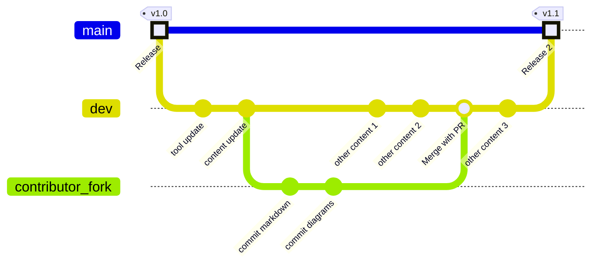

## General Remarks

You are welcome to contribute content (code, documentation etc.) to this open source project.

There are some important things to know:

1. You must **comply to the license of this project**, **accept the Developer Certificate of Origin** (see below) before being able to contribute. The acknowledgement to the DCO will usually be requested from you as part of your first pull request to this project.
2. Please **adhere to our [Code of Conduct](../code-of-conduct.md)**.
3. If you plan to use **generative AI for your contribution**, please see our guideline below.
4. **Not all proposed contributions can be accepted**. Some features may fit another project better or doesn't fit the general direction of this project. Of course, this doesn't apply to most bug fixes, but a major feature implementation for instance needs to be discussed with one of the maintainers first. Possibly, one who touched the related code or module recently. The more effort you invest, the better you should clarify in advance whether the contribution will match the project's direction. The best way would be to just open an issue to discuss the feature you plan to implement (make it clear that you intend to contribute). We will then forward the proposal to the respective code owner. This avoids disappointment.

## Developer Certificate of Origin (DCO)

Contributors will be asked to accept a DCO before they submit the first pull request to this projects, this happens in an automated fashion during the submission process. SAP uses [the standard DCO text of the Linux Foundation](https://developercertificate.org/).

## Contributing with AI-generated code

As artificial intelligence evolves, AI-generated code is becoming valuable for many software projects, including open-source initiatives. While we recognize the potential benefits of incorporating AI-generated content into our open-source projects there a certain requirements that need to be reflected and adhered to when making contributions.

Please see our [guideline for AI-generated code contributions to SAP Open Source Software Projects](https://github.com/SAP/.github/blob/main/CONTRIBUTING_USING_GENAI.md) for these requirements.

## How to Contribute

1. Make sure the change is welcome (see [General Remarks](#general-remarks)).
2. Create a branch by forking the repository.
3. Navigate to the [Get started](get-started.md) section to know how to collaborate on reference architecture.
4. Apply & Save the changes.
5. Commit and push your change on that branch.
6. Sync your forked repository to get latest changes with the main repository to avoid merge conflicts.
7. Create a pull request in the repository using this branch.
8. Follow the link posted by the CLA assistant to your pull request and accept it, as described above.
9. Wait for our code review and approval, possibly enhancing your change on request.
:::info Note
Note that the maintainers have many duties. So, depending on the required effort for reviewing, testing, and clarification, this may take a while.
:::
10. Once the change has been approved and merged, we will inform you in a comment.

The following diagram shows the overall lifecycle of contributor changes in the SAP Architecture Center repository

:::tip Best Practice
Regularly sync with the main repository before contributing or creating a pull request to avoid merge conflicts.
:::