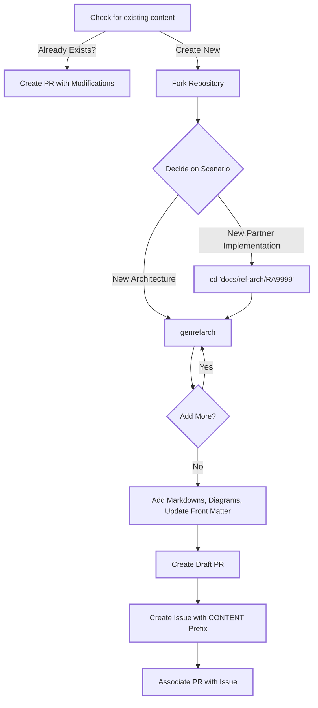

## About this project

Welcome to the SAP Architecture Center | Community of Practice, where we hope to have your contributions on the topic of SAP Reference Architectures. Every software architecture is unique, built to deliver the specific outcomes of your industry, line of business, or country of operation. As such, you will identify areas where this repository can be enhanced with new or updated reference architecture content. 

Our mission is to create a common, collaborative, environment where all SAP experts can co-create, maintain, and enhance reference architectures for every flavor of SAP cloud, on-premises, and partner implementation. To do this, we need your contributions to our community. It starts with your feedback, in the form of GitHub issues or discussions, about what value this resource is bringing you today, or about what's missing. We hope it will continue in the form of a Pull Request, where you make your own contribution to an existing reference architecture, or a new one. To get you started, we've provided some guides and resources below.

## What's in it for you, the contributing expert?

The SAP ecosystem is a large one, and we all play a role in the success or failure of our peers and colleagues. We chose GitHub, and an open contribution model, for this project because there are too many variations of SAP implementations for any single team to tackle alone. We believe that the repeatability of an architecture, and the visibility into how it works, are mandatory for you to build a reliable foundation for your business, and as a result, be better equipped to benefit from further innovation.

Less altruistically, you also have the opportunity to engage with SAP experts, surface the architecture needs of your organization, and gain visibility through your contributions. Authors are named by their GitHub account and can count on the Architecture Center team to drive traffic into your content!

Finally, you never know when good documentation might help you in another opportunity down the road. By bringing your real-world perspective and SAP architectures into this repository now, you make an investment in your future "SAP self", by ensuring these assets are available the next time you need them. The time savings in trying to track down old presentations and emails could be immense!

## Contribution Process

The following diagram shows the workflow process for making a content contribution to the SAP Architecture Center.

## Requirements and Setup

Refer to the [Get Started](Guidelines/get-started.md) page for the requirements & setup.

## Support and Feedback

This project is open to feature requests/suggestions, bug reports etc. via [GitHub issues](https://github.com/SAP/architecture-center/issues/new/choose).

❓ - If you have a *question* you can ask it here in [GitHub Discussions](https://github.com/SAP/architecture-center/discussions).

🐞 - If you find a bug, feel free to create a [bug report](https://github.com/SAP/architecture-center/issues/new?assignees=&labels=bug&projects=&template=bug_report.yml&title=%5BBUG%5D).

💡 - If you have an idea for improvement or a feature request, please open a [feature request](https://github.com/SAP/architecture-center/issues/new?assignees=&labels=enhancement&projects=&template=feature_request.yml&title=%5BFEATURE%5D).

For more information about how to contribute, the project structure, and additional details, see our [Contribution Guidelines](Guidelines/contribution.md).

## Security / Disclosure
If you find any bug that may be a security problem, please follow our instructions at [in our security policy](https://github.com/SAP/architecture-center/security/policy) on how to report it. Please do not create GitHub issues for security-related doubts or problems.

## Code of Conduct

We as members, contributors, and leaders pledge to make participation in our community a harassment-free experience for everyone. By participating in this project, you agree to abide by its [Code of Conduct](code-of-conduct.md) at all times.

## Licensing

Copyright 2025 SAP SE or an SAP affiliate company and architecture-center contributors. Please see our [LICENSE](https://github.com/SAP/architecture-center/blob/main/LICENSE) for copyright and license information. Detailed information including third-party components and their licensing/copyright information is available [via the REUSE tool](https://api.reuse.software/info/github.com/SAP/architecture-center).
