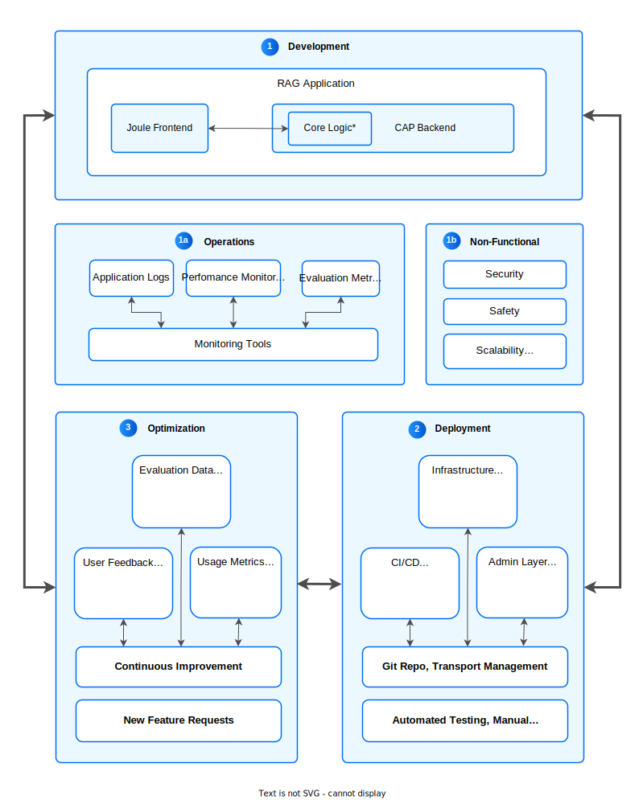

To gain more control over the prompting results of a Large Language Model (LLM) in your application, you can leverage your own specific documents or data using Retrieval Augmented Generation (RAG). Key features of RAG include increased knowledge, as it allows LLMs to provide accurate answers by retrieving up-to-date information from external sources, even if the LLM wasn't trained on that data. RAG also offers flexibility by adapting to different domains, memory efficiency by avoiding model fine-tuning, and higher precision through combining factual data with LLM's language skills. Additionally, it enhances transparency by referencing specific sources for results.

## Architecture

Retrieval Augmented Generation (RAG) is a neural architecture that extends the capabilities of Foundation Models (FMs) or Large Language Models (LLMs) by integrating retrieval mechanisms. These mechanisms allow the model to access external data or text beyond its internal knowledge base, making it adaptable to specific use cases, such as tapping into a customer’s proprietary product database or a curated document set.

The main objective of RAG is to enhance response quality by grounding answers in relevant, real-time data, thus minimizing the likelihood of hallucinations often found in LLM outputs.

RAG is applied to various tasks, including question answering (Q&A) and knowledge-intensive Natural Language Processing (NLP). It effectively combines retrieval and generation approaches, boosting NLP performance in complex scenarios.

A key feature of RAG is its use of embeddings, which can be stored and efficiently retrieved via SAP HANA Cloud's [Vector Engine](./#vector-engine). This platform provides comprehensive tools for creating vector-based tables, conducting similarity searches, and applying other vector functions essential for RAG workflows.

A high-level Flow of how Retrieval Augmented Generation (RAG) operates:

1. **Question Encoding**: The user submits a question or prompt, which is transformed into a dense vector (embedding) by an embedding model.

2. **Document Retrieval**: The embedding is used to query a large corpus of pre-embedded documents via SAP HANA Cloud's Vector Engine. Retrieval typically relies on similarity searches, such as cosine similarity, to identify the top-k most relevant documents or text chunks based on their proximity to the query vector.

3. **Response Generation**: The retrieved documents, along with the original question, are fed into a Large Language Model (LLM), which generates a response by synthesizing both the query and the retrieved information.

For a deeper dive into advanced RAG techniques, explore [A Guide to Advanced RAG Techniques for Success in Business Landscape](https://community.sap.com/t5/technology-blogs-by-sap/a-guide-to-advanced-rag-techniques-for-success-in-business-landscape/ba-p/13571714).

## RAG Operations

The below image shows the high level components of a RAG Application

RAG itself can be analysed under the following subheadings:

1. Knowledge Ingestion
2. Knowledge Retrieval
3. Context Augmentation
4. Generation
5. Evaluation

When there is a need for unique features in a RAG application with complex requirements, certain components of a typical RAG application might have to evolve and the need for Advanced RAG features rises.

**Knowledge Ingestion**
This is the phase where the external documents and the true source documents are collected and processed to enhance the LLM’s knowledge base.
**_Source and Format_** When the source document is unstructured, there could be pre-processing steps needed or there might arise a need for the use of third party document ingestors like [NLM Ingestor](https://github.com/nlmatics/nlm-ingestor) for example.
**_Preparation_** In order to prepare the data for chunking and embedding, a pre-step called prepartion is done. Synthetic Data Generation could be an alternative for situations where data is scarse.
**_Chunking and Embedding_** Custom CAP based application can benefit from the CAP LLM Plugin for efficient and faster development. SAP own RAG solution (work in progress) has detailed guide on grounding and chunking and helper functions to build a complete RAG application.

**Knowledge Retrieval**
In this phase, the user query triggers the retrieval from the embedding storage based on the implemented search algorithm.
**_Storage_** Advanced requirements could demand the use of [Knowledge Graph](https://www.youtube.com/watch?v=PQrFjthwOWQ).
[LangChain](https://python.langchain.com/v0.2/docs/tutorials/rag/) also has guidance on best approaches to store the embeddings.

**_Pre-Retrieval_** When there are multiple source documents the intent determination in advanced RAG applications will demand pre-retreival steps like intent classification. Also when handling sensitive data, anonymization is mandatory. The CAP LLM Plugin also supports anonymization.

**_Search Algorithm_** Apart from the standard search algorithms (like Cosine) supported by HANA Vector Engine, custom logic to do Hybrid search for complex requirements is also possible.

**Context Augmentation**
The context of follow up questions, the length of the context window, and the summarization of the context are some of the steps in this phase.

**_Context Window_** Keeping a tab on the context window ensures that the overall cost of the advanced RAG application doesn't  increase unecessarily. Context is also stored to retrieve the conversation history.

**_Context Tuning_** Maintaining the context for follow-up question to efficiently as well as accurately answer the subsequent questions is part of tuning.

**_Post Retrieval_** Techniques like [reranking](https://cohere.com/rerank) of the retreived results will improve the efficiency of the solution.

**Generation**
The main part of the RAG core logic is the generation of the response.
**_Model Parameters_** Tuning of the model parameters like temperature and top*p will significantly alter the quality of the response.
**\*Prompt Engineering** Covered in the basic prompting section above.
\*\*\_Optimization*\*\* Iterative approach to revisit and redefine each of the RAG application steps to tune the parameters and logic to optimize the solution for accuracy and performance.

**Evaluation**
The overall quality check of the RAG solution is carried out in this step. The quality in terms of performance, correctness, cost effectiveness are all included.
**_Preparation_** Prepare for this phase by zero-ing in on the desired metrics by reviewing the logs. [Cost Calculator](https://ai-core-calculator.cfapps.eu10.hana.ondemand.com/uimodule/index.html) is a handy tool to convert token size to CU and further to monthly cost in $.
**_Metrics_** The [major available metrics](https://docs.ragas.io/en/latest/concepts/metrics/index.html) to measure each segment of a RAG application are to be reviewed and identified specific to the current use case.
**_Action_** Following the recommended Reference Architecture patterns, reviewing and adhering to suggestions from ACDs and ADRs, reacting to the measured metrics - are some of the possible actions to mature the RAG application and to get it production ready

## Services & Components

For a comprehensive list of services, components and descriptions, please explore the Introduction on [Services & Components](./#services--components).

## Examples

Take a look at the following examples that build upon or implement elements of the Reference Architecture:

- [GenAI Mail Insights: Develop a CAP-based (multitenant) application using GenAI and Retrieval Augmented Generation (RAG)](https://discovery-center.cloud.sap/missiondetail/4371/)
- [RAG Quickstart using CAP LLM Plugin](https://github.com/SAP-samples/cap-llm-plugin-samples/tree/main/samples/rag-quickstart-app)
