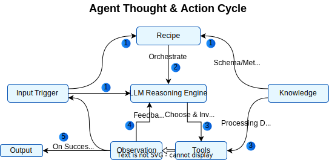
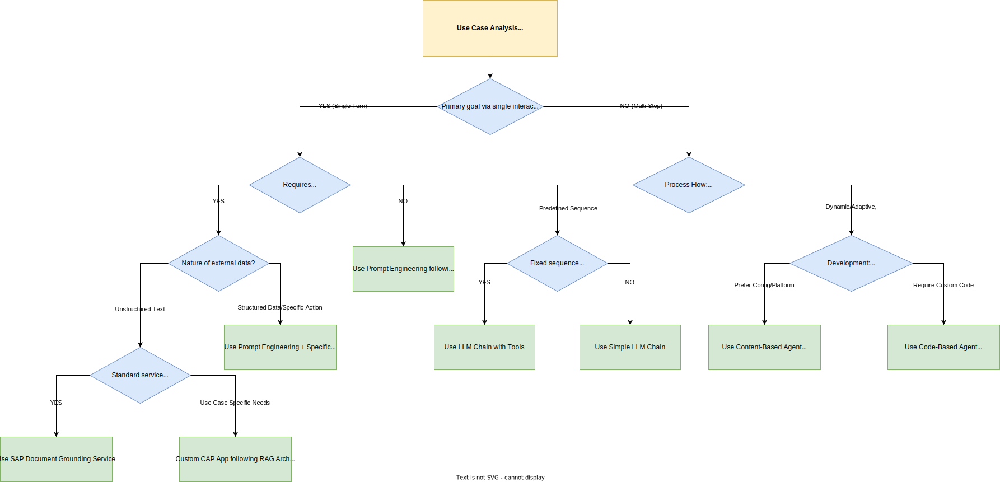

AI agents bridge a critical gap in enterprise automation by autonomously executing multi-step processes, dynamically adjusting their strategies based on real-time context, and integrating seamlessly with enterprise services. They excel where traditional automation and single-turn LLM interactions fall short - handling tasks that require adaptive reasoning, conditional logic, and orchestration across heterogeneous environments. As modern enterprises face increasingly complex, non-linear workflows that span multiple systems, data sources, and decision points, AI agents provide the intelligence and flexibility needed to drive meaningful outcomes.

## Project Agent Builder

*Project Agent Builder (PAB)* is SAP’s centralized platform for creating, managing, and consuming agents as reusable services on SAP BTP.

PAB removes the need for custom runtimes by offering no‑code, configuration‑driven LLM agent creation that supports multi‑step reasoning, tool orchestration, and RAG. Using REST/OData APIs, it integrates seamlessly with SAP products, BTP services, and third‑party apps, while leveraging SAP AI Core for LLM access, anonymization, metering, and role‑based security. Built on LangChain and backed by a marketplace for SAP Joule extensibility, PAB delivers a scalable, secure foundation for agent‑based automation across the SAP ecosystem.

## Agent Streams

Within SAP’s approach to agent development, two commonly referenced patterns have emerged *Content-Based Agents* and *Code-Based Agents* to distinguish strategies based on configuration-driven versus programmatic implementations. While not universally standardized, these terms help structure design decisions within SAP’s GenAI development landscape.

**Content Based Agents**

Content Based Agents are fully supported within Project Agent Builder. They utilize structured business content and pre‑defined semantic rules to drive agent behavior, integrate off‑the‑shelf tools for multi‑step reasoning and dynamic decision‑making, and require minimal custom coding. This approach enables rapid configuration and seamless ingestion of enterprise data into automated workflows.

**Code Based Agents**

Code Based Agents offer a highly customizable solution through bespoke logic and tailored development. They leverage developer-defined workflows on frameworks like LangGraph, AutoGen, CrewAI & smolagents to provide fine-grained control over agent operations. This model is ideal for scenarios that demand precise, code-level intervention to meet complex business requirements.

## Elements of AI Agents

To understand the technical working of an AI Agent, consider its five core components explained below.

- **LLM - Reasoning Engine:**
Processes inputs, plans steps, and generates natural‑language or structured outputs.

- **Knowledge:**
Contextual information from structured and unstructured sources to guide agent decision-making.

- **Memory - State:**
Retains intermediate results and past interactions, ensuring continuity and statefulness across multi‑step workflows.

- **Tools:**
Enable agents to perform actions. The agent selects and invokes tools based on the current context and goal.

- **Recipe - Orchestration Logic:**
A recipe guides the agent's workflow and defines how the LLM, knowledge, memory, and tools interact.

The diagram below illustrates the agent’s actions cycle at runtime, which could repeat multiple times till the goal is declared achieved by the LLM. The numbered steps correspond to:

1. **Input & Orchestration** – The user’s request and Recipe logic are ingested by the LLM.  
2. **Guidance** – The Recipe supplies a plan based on orchestration rules and schema/metadata to steer the LLM’s planning.  
3. **Tool Invocation** – The LLM selects and invokes the appropriate Tools, using the Knowledge.
4. **Observation** – Tool outputs are captured and fed back into the LLM for further reasoning.
5. **Final Output** – Once the goal is achieved, the agent emits the final response.  

## Selecting the Right Approach

Unlike linear pipelines such as RAG which strictly follow “retrieve → generate → respond”, or even fixed LLM chains with predetermined steps, Agents employ iterative reasoning. They continuously assess and adapt on the fly as discussed above which empowers agents to solve non‑linear problems, handle exceptions, and manage layered business workflows.

But, not all use cases require the same level of orchestration or intelligence. Depending on factors like interaction complexity, the need for real-time data, and the nature of the underlying process, different design strategies are optimal ranging from simple prompt engineering to agents.

The decision tree below serves as a practical guide to determine the most suitable implementation pattern for your scenario be it prompt-based, tool-integrated, or agentic.

## Agent Evaluation

Having determined that an agentic approach is suitable for your use case using the decision framework, the next critical phase is rigorous evaluation. Before deploying AI agents, especially those interacting with core SAP systems and processes, a comprehensive assessment across key dimensions is mandatory. The following table outlines essential dimensions for evaluating AI agents within the SAP context and also provides some tools and concepts that can be used to perform the validation:
| Category                        | Definition                                                                                       | Importance in SAP Context                                                                                            | Evaluation Methods / Tools                                                                                                                                                           |
| :------------------------------ | :----------------------------------------------------------------------------------------------- | :------------------------------------------------------------------------------------------------------------------- | :----------------------------------------------------------------------------------------------------------------------------------------------------------------------------------- |
| **Task Completion Rate & Accuracy** | Quantitative success in achieving the specified goal and the fidelity of the response.             | Ensures reliable execution of core business functions and maintains data integrity within SAP systems.                 | Golden Datasets, End-to-End Testing, Manual Review, Evaluation Frameworks (LangSmith, TruLens, W&B)                                                                                    |
| **Tool Usage Correctness** | Accuracy in tool selection, parameterization, and interpretation of results.                   | Critical for preventing data corruption, failed transactions, or security vulnerabilities via SAP interfaces (APIs, OData). | Trace/Log Analysis, Unit/Integration Testing, LLM-as-Judge ([link](https://arxiv.org/abs/2306.05685)), Evaluation Frameworks (LangSmith Trace View, TruLens Feedback Functions)       |
| **Reasoning Quality & Planning**| Coherence, efficiency, and validity of the agent's generated action sequence (plan).             | Impacts cost-efficiency (token/API usage), execution speed, and feasibility for complex, multi-step SAP processes.   | Trace Analysis, Intermediate Step Validation, Manual Review                                                                                                                          |
| **Robustness & Error Handling** | Agent's ability to maintain function despite invalid inputs, tool failures, or environmental shifts. | Maintains operational continuity and process stability despite inevitable failures within integrated SAP environments. | Failure Injection Testing, Adversarial Testing, Log Analysis                                                                                                                       |
| **Latency & Throughput** | Time-to-completion per task (Latency) and the system's capacity for concurrent execution (Throughput). | Defines user experience acceptability and system scalability for both interactive and batch SAP workloads.             | Benchmarking, Load Testing, Performance Profiling, Monitoring Tools (APM tools, LangSmith)                                                                                           |
| **Cost** | Resource consumption per task execution, including LLM tokens, API calls, and compute.           | Ensures predictable OpEx, enabling accurate ROI calculations for agent deployments within SAP budget constraints.      | Token Counting, Cost Tracking Services (e.g., LangSmith), API Usage Monitoring, Resource Monitoring                                                                                  |
| **Safety & Responsibility** | Compliance with security policies, ethical constraints, data privacy regulations, and bias mitigation. | Essential for data protection, regulatory adherence, mitigating bias, and maintaining corporate reputation.            | Red Teaming, Guardrails (custom logic, framework-provided), Bias Detection Tools & Techniques, Compliance Audits, Access Control Verification, Content Moderation Integration        |

Systematic evaluation using these dimensions provides the necessary assurance for deploying AI agents responsibly and effectively within SAP enterprise landscape.