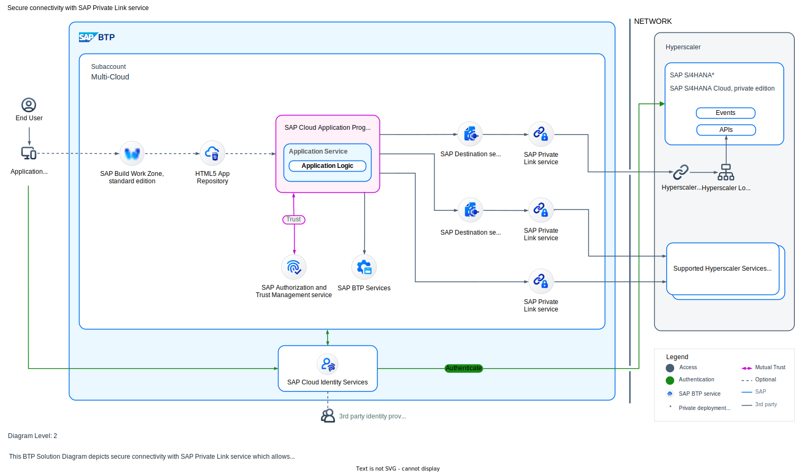

Secure connectivity is crucial for organizations that handle critical business operations across various cloud environments. To reduce vulnerabilities and potential security risks, it is important to transfer sensitive data within a protected and private networks. Network setups that expose traffic to the public internet increase the probability of security breaches and unauthorized access.

Establishing private, secure connections between applications and cloud services helps businesses meet regulatory requirements while also improving data protection. Organizations can drastically lower their attack surface by using private networks instead of public internet routing.

### **Secure connectivity with SAP Private Link service**

SAP Private Link service is a feature offered by cloud providers like Microsoft Azure and Amazon Web Services (AWS) that allows customers to expose their services in their virtual networks to consumers in other virtual networks or subscriptions. The primary goal of Private Link service is to ensure that data offered by service providers is only accessible through a private endpoint, which ensures that the data doesn't traverse over the public internet.

SAP Private Link service allows to securely connect applications running on SAP BTP to workloads running on hyperscalers. This ensures that traffic is not routed through the public internet but stays within the hyperscaler infrastructure. This helps to minimize attack vectors and ensures secure communication between SAP BTP and hyperscaler workload. To privately access a service in hyperscaler Provider account, the SAP Private Link service creates a private endpoint that establishes a point-to-site connection between SAP BTP and the hyperscaler service:

More details about [SAP Private Link service](https://help.sap.com/docs/PRIVATE_LINK?locale=en-US).

## Architecture

## Flow
To establish the private connection, you first need create a service instance of the SAP Private Link service by providing the identifier of the IaaS provider service instance. After approving the creation of the private endpoint in your IaaS provider account, you bind the service instance to your application and can then start using the private endpoint.

However, this binding does not include any credentials for accessing the service in your own IaaS account. You need to provide the credentials to your application by different means, for example, by creating a user-provided service that contains the required information, and binding it to the application.

**Service Identifier**: The unique identifier of a service instance of an IaaS provider service that has to be provided during the creation of the SAP Private Link service instance. The actual term depends on the IaaS provider, for example, in Azure, this unique service identifier is called service resource.
   
**Service Instance**: Creating a service instance of the SAP Private Link service sets up a private endpoint that is associated with this service instance.

**Binding**: Binding the service instance of the SAP Private Link service to the application gives the Cloud Foundry space access to the private endpoint. Binding the user-provided service to the application shares the service credentials with the application.

**Credentials**: Creating a user-provided service, for example, enables you to share the credentials of the bound service instance in the IaaS provider account with the application in your SAP BTP account.

## Characteristics
Currently SAP Private Link service supports private endpoints on Microsoft Azure and Amazon Web Services. Supported services from each of the vendors are as follows:
- [Supported Microsoft Azure services](https://help.sap.com/docs/private-link/private-link1/consume-azure-services-in-sap-btp): To privately access a service in your Azure subcription, SAP Private Link service creates a private endpoint and reuses the private link functionality of Azure. 
- [Supported AWS services](https://help.sap.com/docs/private-link/private-link1/consume-amazon-web-services-in-sap-btp): To privately access a service in your AWS subcription, SAP Private Link service creates a private endpoint and reuses the private link functionality of AWS. 

The Private Link service currently only supports the SAP BTP **Cloud Foundry** runtime and **Kyma** runtime.

## Examples in an SAP Context

**Establish connection to SAP S/4HANA or other SAP or non-SAP systems running on a VM of hyperscaler:**

The most commonly used use case for SAP Private Link service is to communicate with an SAP S/4HANA system or other SAP or non-SAP systems running on a VM in your own Microsoft Azure or AWS account privately from within SAP BTP, Cloud Foundry or Kyma environment.

This connection can be established by creating a hyperscaler Endpoint Service that exposes a Load Balancer which routes traffic to the SAP S/4HANA system. The service name of that Endpoint Service must then be used to create an SAP Private Link service instance. As soon as the connection is established successfully, the SAP Private Link service provides a private hostname pointing to your Endpoint Service.

You can also find an end-to-end SAP S/4HANA extension use case with step-by-step instructions, both for AWS and Azure, in this use case titled [Enhance core ERP business processes with resilient applications on SAP BTP](https://github.com/SAP-samples/btp-build-resilient-apps).

**Consume hyperscaler native services:**
   
Another use case is to use the service name of one of the supported services offered by AWS or Azure instead of a custom service name. The basic functionality remains the same, but instead of connecting to a custom endpoint exposed via an AWS Endpoint Service or Azure Private Link Service, the connection will be established to a service natively provided by AWS or Azure, such as Amazon Simple Queue Service (SQS) or an Azure Storage Account.

## Services and Components

- **[SAP Private Link service](https://discovery-center.cloud.sap/serviceCatalog/private-link-service?service_plan=standard&region=all&commercialModel=cloud)**: SAP Private Link service establishes a private connection between selected SAP BTP services and selected services in your own IaaS provider accounts.
  
- **[SAP Destination service](https://discovery-center.cloud.sap/serviceCatalog/destination?service_plan=lite&region=all&commercialModel=cloud)**: The Destination service lets you retrieve the backend destination details you need to configure applications in the Cloud Foundry environment.

- **[SAP Authorization and Trust Management service](https://discovery-center.cloud.sap/serviceCatalog/authorization-and-trust-management-service?region=all)**: The SAP Authorization and Trust Management service lets you manage user authorizations and trust to identity providers. Identity providers are the user base for applications. We recommend that you use an IAS identity authentication tenant, an SAP on-premise system, or a custom corporate identity provider.

- **[SAP Cloud Identity Services - Identity Authentication](https://discovery-center.cloud.sap/serviceCatalog/identity-authentication?region=all)**: The Identity Authentication service provides you with controlled cloud-based access to business processes, applications, and data. It simplifies your user experience through authentication mechanisms, single sign-on, on-premise integration, and convenient self-service options.

- **[SAP Business Application Studio](https://discovery-center.cloud.sap/serviceCatalog/business-application-studio?region=all)**: SAP Business Application Studio is a powerful and modern cloud development environment, tailored for efficient development of business applications for the Intelligent Enterprise.

- **[SAP Build Work Zone, standard edition](https://discovery-center.cloud.sap/serviceCatalog/sap-build-work-zone-standard-edition?region=all)**: SAP Build Work Zone, standard edition enables organizations to establish a unified point of access to SAP (e.g. SAP S/4HANA), custom-built, and third party applications and extensions, both on the cloud and on-premise. 

- **[SAP HTML5 Application Repository Service for SAP BTP](https://discovery-center.cloud.sap/serviceCatalog/html5-application-repository-service?region=all)**: The HTML5 Application Repository service for SAP BTP enables central storage of HTML5 applications on SAP BTP. The service allows application developers to manage the lifecycle of their HTML5 applications.

## Resources

For more information about the different technologies used as part of this reference architecture you may check out the following resources:

- **Documentation**
    - [SAP Private Link service](https://help.sap.com/docs/private-link)
    - [Azure Private Link](https://azure.microsoft.com/en-us/products/private-link)
    - [AwS Private Link](https://aws.amazon.com/privatelink/)

- **Tutorials:**
    - [Connect SAP Private Link service to Microsoft Azure Private Link Service (CF)](https://developers.sap.com/mission.private-link-connect.html)
    - [Connect SAP Private Link service to Microsoft Azure Private Link Service (Kyma)](https://developers.sap.com/tutorials/private-link-azure-kyma.html)
    - [Connect SAP Private Link service to AWS Private Link Service (CF)](https://developers.sap.com/tutorials/private-link-aws.html)
    - [Connect SAP Private Link service to AWS Private Link Service (Kyma)](https://developers.sap.com/tutorials/private-link-aws-kyma.html)

- **Samples on Github:**
    - [Enhance core ERP business processes with resilient applications on SAP BTP](https://github.com/SAP-samples/btp-build-resilient-apps/blob/main/tutorials/05_setupconnectivity/privatelink.md)
    - [SAP Private Link Service Use Cases for SAP Cloud Integration and SAP Build Work Zone, Standard Edition](https://github.com/SAP-samples/btp-private-link-approuter)

- **SAP Community blog posts:**
    - [Extend your Business Processes with the new SAP Private Link service](https://blogs.sap.com/2022/06/03/extend-your-business-processes-with-the-new-sap-private-link-service/)
    - [SAP Private Link in Action: How FrieslandCampina safeguards their integration flows with Azure Storage Account](https://blogs.sap.com/2023/04/07/sap-private-link-in-action-how-frieslandcampina-safeguards-their-integration-flows-with-azure-storage-account/)
    - [SAP Private Link service use cases for SAP Cloud Integration and SAP Build Work Zone, standard edition (SAP community blog post)](https://blogs.sap.com/2022/08/22/sap-private-link-service-use-cases-for-sap-cloud-integration-and-sap-launchpad/)
    - [SAP Private linky swear with Azure – running Cloud Connector and SAP Private Link side-by-side](https://blogs.sap.com/2022/07/07/btp-private-linky-swear-with-azure-running-cloud-connector-and-sap-private-link-side-by-side/)
    - [SAP Private Link service is integrated to SAP BTP, Kyma runtime](https://community.sap.com/t5/technology-blogs-by-sap/sap-private-link-service-is-integrated-to-sap-btp-kyma-runtime/ba-p/13614067)

## Related Missions

If you would like to implement solutions that are related to this reference architecture and technologies used you may continue with the following SAP Discovery Center missions:

- [Enhance core ERP business processes with resilient applications on SAP BTP](https://discovery-center.cloud.sap/missiondetail/3501/3542/)
- [Build Events-to-Business Actions Apps with SAP BTP and MS Azure/AWS](https://discovery-center.cloud.sap/missiondetail/4172/4422/)
- [Enable Supplier Collaboration across SAP and Microsoft Azure Ecosystem using SAP BTP](https://discovery-center.cloud.sap/missiondetail/4068/4280/)
