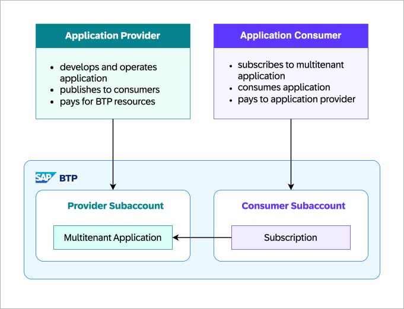
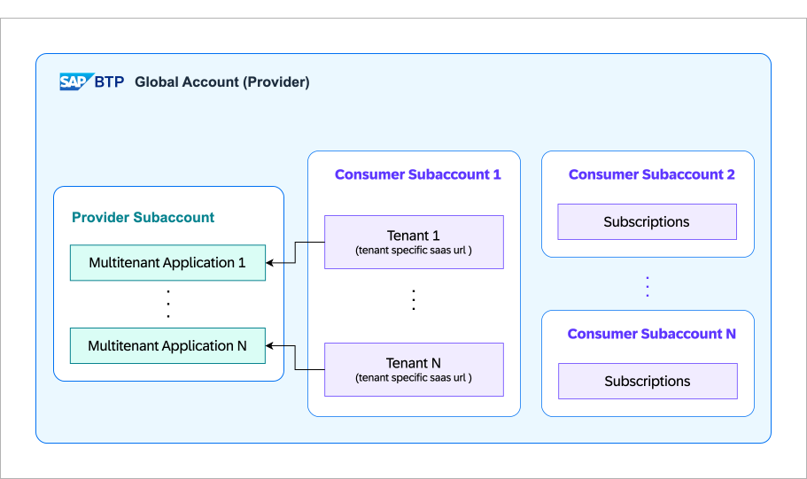

There are multiple ways to design a multitenant application. Your choice of approach depends importantly on whether and how you share resources among your tenants. Intuitively, the more resources you share, the more cost-efficient your application will be. However, sharing resources might also increase the complexity of your application. In SAP BTP, you can develop and run multitenant applications that can be accessed by multiple consumers (tenants) through a dedicated URL.

When designing a multitenant application, it is important to understand different personas involved. The multitenancy concept involves two main personas:
  - #### Application Provider 
    The entity that develops, deploys, and manages the multitenant application. This could be an independent software vendor (ISV), a software development company, or an internal IT department. The application provider is responsible for creating the software, configuring the multitenant architecture, and managing the application lifecycle.
  - #### Application Consumer 
    The end-user or tenant who interacts with the multitenant application. This could be an individual user, a company, or an organization that subscribes to the service. The application consumer uses the software to perform specific tasks or access functionality provided by the application provider.

## Multitenancy Model on SAP BTP

Before jumping into the details of multitenancy model on SAP BTP, it is important to understand the concept of Account Model or Structure of SAP BTP. It is highly recommended to go through the [Account Model of SAP BTP](https://help.sap.com/docs/btp/sap-business-technology-platform/account-model) to understand the concept of global account, subaccount etc.

In SAP BTP, multitenancy is implemented using the concept of [subaccounts](https://help.sap.com/docs/btp/sap-business-technology-platform/account-model#subaccounts). In multitenancy context, two kinds of subaccounts are used:

- #### Provider Subaccount 
  The application provider is the vendor of the SaaS application. The application provider is going to build, deliver, and operate the multitenant SaaS solution for all consumers. It owns a global account in SAP BTP and builds and deploys the application in a Subaccount which is referred as the provider subaccount.

- #### Consumer/Tenant Subaccount
  A consumer or tenant is the user of the SaaS application. This can be another team or company that will use the multitenant SaaS solution. For each consumer, a dedicated subaccount is created within the vendor's global account in SAP BTP. Each consumer subscribes to the SaaS solution from their subaccount, referred to as the consumer subaccount. Upon subscription to the SaaS application, each consumer receives a dedicated URL to access the SaaS application.

  :::tip Consumer vs Tenant
  It's important to differentiate between consumer and tenant. While a consumer can consume multiple SaaS applications, a tenant is a specific instance of a SaaS application of a dedicated consumer. Still, a tenant subaccount and a consumer subaccount refer to the same entity, meaning a dedicated subaccount in which multiple tenant instances of SaaS applications are subscribed.

  - subaccount - consumer [1..1]: For each subaccount, there can only be one consumer assignment
  - subaccount - tenant [1..1]: For each subaccount, there can only be one tenant per SaaS application
  - consumer - tenant [1..1]: For each consumer, there can only be one tenant per SaaS application
  :::

### Application Provider Point of View

The following figure illustrates the relationship between the provider subaccount and consumer subaccounts (tenants) in the application provider's global account in SAP BTP.

The application provider deploys the multitenant application to the provider subaccount. The application is then registered with the [SAP Software-as-a-Service Provisioning service](https://discovery-center.cloud.sap/serviceCatalog/saas-provisioning-service?service_plan=application&region=all&commercialModel=btpea), which makes the application available in service marketplace for subscription from consumer subaccount. Subsequently the consumer subaccounts subscribe to the SaaS application. 

:::info SAP Software-as-a-Service Provisioning service: 
  This service helps manage and automate the subscription lifecycle of multitenant applications on SAP BTP. It provides apis for registering, subscribing, and managing SaaS applications and tenants. Key feature of the service includes:
  - Subscription Management: enables subscribing and unsubscribing tenants to multitenant applications and services.
  - Registration Details: retrieves details of registered multitenant applications.
  - Subscription Information: provides information on current subscriptions, including tenant ids and dependencies.
  - Dependency Management: allows updating services that a multitenant application depends on.
  - Job Information: tracks the status of subscription-related operations, like subscribing, unsubscribing, or updating dependencies.
  In short, this service manages the lifecycle of multitenant applications, including tenant subscription, registration, dependency updates, and related job status tracking.
:::

<!-- The application uses the tenant-aware approuter application and xsuaa service to authenticate business users of the application at runtime. -->

### Application Consumer Point of View

Each consumer has a dedicated subaccount in the application provider's global account. The consumer subscribes to the application using either the SAP BTP cockpit, SAP BTP command-line interface, or a dedicated REST api. The consumer receives a dedicated URL so that its business users can access the application. When a consumer accesses the application, the application environment identifies them by their unique tenant id. The application distinguishes between requests from different consumer tenants based on the tenant id, thus ensuring data isolation.

As with any application running in SAP BTP, these multitenant applications consume platform resources. The costs for these consumed resources, and those of the application consumer, are billed to the provider of the multitenant application.

## Data Separation in Multitenant Applications

Data separation is a key aspect of multitenant applications. Each tenant's data and configurations are kept separate from other tenants. This is crucial for maintaining data privacy, security, and compliance. There are three main approaches to achieving data separation in a multitenant architecture.

1. ### Column Discriminator

    In this approach, a column discriminator is used to differentiate between data belonging to different tenants. Only one table is used for the entire application and for all consumers. Each table in the database has an additional column that stores the tenant id. At the application level, every CRUD operation (Create, Read, Update, Delete) needs to filter based on the tenant id. For example, when performing an INSERT or SELECT, a WHERE clause on the tenant id must be used to ensure that each tenant only interacts with its own data.
    - **Pros**: cost-effective since it utilizes a single schema within a single database instance, easy to set up.
    - **Cons**: requires additional filtering logic in all queries, can lead to performance overhead, higher risk of exposing unwanted data, may not compliant with data protection laws.

2. ### Database Separation

    In this approach, each tenant has their own dedicated database instance. The application uses a separate database connection for each tenant, ensuring that data is isolated at the database level. This approach is more secure and compliant with data protection laws, as each tenant's data is physically separated from other tenants.
    - **Pros**: secure and compliant with data protection laws, better performance, less risk of exposing unwanted data.
    - **Cons**: higher cost due to multiple database instances, more complex to set up and maintain.

3. ### Schema Separation

    In this approach, each tenant has their own dedicated schema within a shared database instance. The application uses a separate schema for each tenant, ensuring that data is isolated at the schema level. This approach provides a balance between cost and security, as each tenant's data is logically separated but physically stored in the same database instance.
    - **Pros**: cost-effective, secure, and compliant with data protection laws, less risk of exposing unwanted data.
    - **Cons**: more complex to set up and maintain compared to column discriminator, may require additional logic to manage schema creation and deletion.
    
    :::tip SAP Recommendation
    SAP recommends schema separation approach for its flexibility and cost-effectiveness. 
    
    In case of [SAP HANA Cloud](https://discovery-center.cloud.sap/serviceCatalog/sap-hana-cloud?region=all), the [HDI container feature](https://help.sap.com/docs/hana-cloud-database/sap-hana-cloud-sap-hana-database-developer-guide-for-cloud-foundry-multitarget-applications-sap-web-ide-full-stack/sap-hana-cloud-deployment-infrastructure-services) is used to implement schema separation. 
    
    HDI containers provide isolation. Identical objects can be deployed multiple times into various HDI containers in the same SAP HANA Cloud database. This allows for the installation of multiple instances of the same software product within the same database. HDI containers are segregated from each other using schema level access permissions. By default, access between containers at the database level is prohibited. However, this can be overridden by granting the relevant privileges, for instance, by using synonyms. With this, an application is provided with the necessary credentials to access an HDI container, which is essentially a database schema that comes with supplementary metadata.

    For each consumer tenant, a dedicated HDI container is created, which contains the schema and tables specific to that tenant. On subscription, creation of HDI container for each consumer can be automated with [SAP Service Manager](https://discovery-center.cloud.sap/serviceCatalog/service-manager?region=all) which helps to create or manage service instances on SAP BTP.
    :::

    :::info SAP Service Manager
    SAP Service Manager service is the central registry for service brokers and platforms in SAP BTP. It allows you to consume platform services in any connected runtime environment, track the creation and management of service instances, and share services and service instances between different environments.

    SAP Service Manager supports services that implement the Open Service Broker API Information (OSBAPI), and can be consumed natively in OSBAPI-enabled environments such as cloud foundry and kubernetes. SAP Service Manager can be accessed via the SAP BTP cockpit, command line tool or api, and allows management of platforms, service brokers, service instances, and service bindings. It's tightly integrated with SAP BTP services, and enforces service access rules and quotas.
    :::

## References
- [SAP Blog - Fundamentals of Multitenancy in SAP BTP](https://community.sap.com/t5/technology-blogs-by-sap/fundamentals-of-multitenancy-in-sap-btp/ba-p/13527283)
- [Developing Multitenant Applications in the Cloud Foundry Environment](https://help.sap.com/docs/btp/sap-business-technology-platform/developing-multitenant-applications-in-cloud-foundry-environment)
- [Multitenant SaaS database tenancy patterns](https://learn.microsoft.com/en-us/azure/azure-sql/database/saas-tenancy-app-design-patterns?view=azuresql)
- [SAP HANA Cloud Deployment-Infrastructure Services](https://help.sap.com/docs/hana-cloud-database/sap-hana-cloud-sap-hana-database-developer-guide-for-cloud-foundry-multitarget-applications-sap-web-ide-full-stack/sap-hana-cloud-deployment-infrastructure-services)