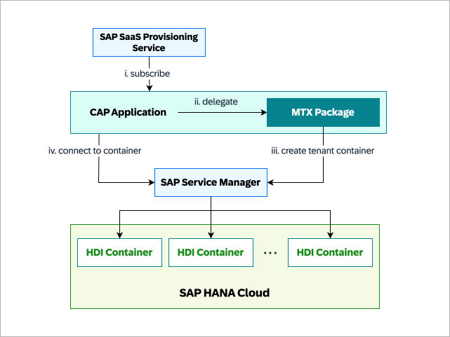
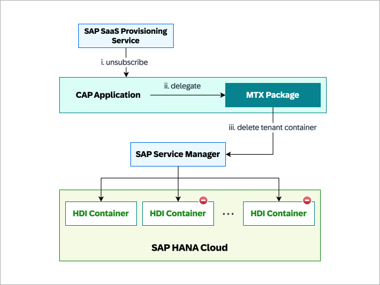

When evaluating a multitenant architecture, it's crucial to account for every phase of a tenant's lifecycle. This includes onboarding, provisioning, and offboarding tenants. Each phase has its own set of challenges and requirements, which must be addressed to ensure a seamless experience for both the application provider and the consumers. Managing the tenant lifecycle is a critical aspect of multitenant architectures. It is important to have clear policies and procedures in place for each phase of the tenant lifecycle to ensure consistency, security, and compliance with regulations.

Let's look at the different phases of the tenant lifecycle and how they can be managed effectively in a multitenant environment.

## Tenant Lifecycle Phases

- ### Tenant Onboarding
  There are often confusing definitions of what onboarding and provisioning of tenants mean. In the context of multitenancy and SAP BTP, the following definition is considered:

  - **Onboarding** is the end-to-end process of creating a subaccount for a new SaaS Consumer in the vendor's Global Account in SAP BTP and giving access to the actual Consumer Tenant SaaS application instance. 
  - **Provisioning** is the process of onboarding new consumers to the multitenant SaaS solution. During the provisioning process, a tenant-specific HDI Container is created and other dependencies are injected into the Consumer Subaccount.

  However for simplicity, we will use the term **_Tenant Onboarding_** to refer to the entire process including provisioning which involves creating a dedicated subaccount for the consumer, provisioning resources (SAP BTP Services), and configuring the application environment. The onboarding process can be automated to handle multiple tenants simultaneously.
    
  Depending on the design and complexity of the application, the onboarding process may involve the following steps:
    - Create a new subaccount for the consumer in the provider's Global Account.
    - Assign roles and permissions to the consumer.
    - Subscribe to the SaaS application from the consumer subaccount.
      On trigger of subscription, the application provider may need to provision resources like HDI containers, or other services required for the tenant. Once application is successfully subscribed, The consumer gets a dedicated URL to access the application. 
    - Configure the application environment for the tenant.    

  Here, provisioning of resources is a crucial step in the onboarding process. It involves setting up or configuring the necessary services on SAP BTP. To ensure a smooth onboarding experience, the application provider may automate the provisioning process to reduce manual effort and minimize errors.

    #### Onboarding Implementation with CAP
    CAP has built-in support for multitenancy with the [@sap/cds-mtxs package](https://www.npmjs.com/package/@sap/cds-mtxs). The @sap/cds-mtxs package provides a set of services that implement multitenancy, features toggles, and extensibility. @sap/cds-mtxs offers an easy way to integrate dependent services such as SAP SaaS Provisioning Service, SAP Service Manager, User Account and Authentication Service etc. into the CAP application. CAP includes these MTX services, which provide out-of-the-box handlers for subscribe / unsubscribe events, for example to manage SAP HANA database containers. For more information, refer [CAP documentation: MTX Service Reference](https://cap.cloud.sap/docs/guides/multitenancy/mtxs#mtx-services-reference).
    The following graphic illustrates the process when a user subscribes to a SaaS application from the Service Marketplace:
    - The SaaS Provisioning Service sends a subscription event to the CAP application.
    - The CAP application forwards the request to the MTX services.
    - The MTX services utilize the SAP Service Manager to create the database tenant.
    - The CAP application connects to this tenant at runtime using the Service Manager.

    

    It is also possible to add custom logic for tenant onboarding using MTX within CAP. For example, you can create custom handlers to manage the onboarding process, such as creating a destination for connecting to business systems like SAP S/4HANA, assigning roles, setting up routes in Cloud Foundry, defining api rules in Kyma, or creating SAP BTP service instances.

    :::tip Quick Tip
    If the provisioning process is complex and time-consuming, consider using a queue-based approach to manage the creation of dependent resources. Once these resources are ready, you can notify the consumer using [SAP Alert Notification Service](https://discovery-center.cloud.sap/serviceCatalog/sap-alert-notification-service?region=all). This approach helps streamline the onboarding process and improves the overall experience for the consumer.
    :::

- ### Tenant Upgrade
  Tenant Upgrade is the process of updating the application environment for an existing tenant. This can happen due to various reasons, such as changes in the consumer's subscription plan, updates to the application features, or bug fixes. The upgrade process should be seamless and transparent to the consumer, ensuring that they can continue using the application without any interruptions.  

  The tenant upgrade process may involve the following steps:
    - Identify the changes required for the tenant, such as updating the application with new features, or fixing bugs.
    - Notify the consumer about the upcoming changes and provide any necessary information or support.
    - Upgrade the application for the tenant, such as deploying new code, modifying configurations, or migrating data.
    - Test the changes to ensure they work as expected and do not introduce any issues.
    - Notify the consumer once the upgrade is complete and provide any additional information about the upgrade.

  On your journey with your multitenant application, at some point, it might be required to modify CDS model of SaaS application while having active subscribed consumer subaccounts. When a field is added or removed from CDS model, it is not automatically reflected to tenant's HDI container automatically after deployment. It requires an update request to  multitenant CAP application to re-deploy the latest changes to the tenant’s HDI container.

    #### Upgrade Implementation with CAP
    CAP provides functionality as part of MTX services that handle the upgrade process for tenants. With MTX, tenant specific HDI Container is updated as per modified CDS model of SaaS application. Note that, tenant specific HDI containers needs to be individually updated with latest changes. MTX service of CAP provides api where upgrade of one or many consumer tenants can be triggered. This functionality can be extended or customized to meet specific requirements, such as adding or upgrading SAP BTP resources or notifying consumers about the upgrade process. The upgrade process may include the following steps:
      - update the SaaS application with new feature or fix bugs
      - deploy the upgraded SaaS application in provider subaccount
      - trigger tenant update request for each consumer subaccount if any schema changes are made in CDS model.

    The following steps explain what happens when an update request is sent to deploy the modified CDS model into the tenant's HDI container:
      - The SaaS Provisioning Service calls the tenant upgrade action of the CAP application for one more tenants.
      - The CAP application delegates the request to the MTX services to deploy the modified CDS model.
      - The CAP application serves latest service metadata using MTX service.

  :::info Important Information
  Upgrade of tenant can be triggered via [Subscription Management Dashboard](https://help.sap.com/docs/btp/sap-business-technology-platform/using-subscription-management-dashboard) or calling rest api of SAP SaaS Provisioning Service or directly calling the MTX services of your SaaS Application.
  :::

- ### Tenant Offboarding
  Tenant offboarding is the process of removing a tenant from the system. This can occur for various reasons, such as the consumer canceling their subscription or the vendor discontinuing the service. The offboarding process should be handled carefully to ensure that the tenant's data is securely deleted and that resources are properly released. The offboarding process may involve the following steps:
    - Confirm the consumer's unsubscription and revoke their access to the application.
    - Delete the tenant's data and configurations from the application environment.
    - Release the resources allocated to the tenant, such as SAP BTP service instances, HDI containers, etc.
    - Notify the consumer about the offboarding process and provide any necessary information or support.
    - Delete the consumer's subaccount from the provider's global account in SAP BTP.

  :::tip Quick Tip
  It is important to have clear policies and procedures in place for tenant offboarding to ensure data privacy and compliance with regulations. The offboarding process should be documented and communicated to consumers to maintain transparency and trust.
  :::

    #### Offboarding Implementation with CAP

    CAP provides functionality as part of MTX services to handle the offboarding process for tenants. With MTX, the tenant-specific HDI container is automatically deleted using SAP Service Manager. This functionality can be extended or customized to meet specific requirements, such as deleting additional SAP BTP resources or notifying consumers about the offboarding process. By leveraging the MTX services in CAP, you can automate the offboarding process and ensure that tenants are removed securely and efficiently.

    The following graphic illustrates the process when a user unsubscribes from a SaaS application:
    - The SaaS Provisioning Service sends an unsubscribe event to the CAP application.
    - The CAP application delegates the request to the MTX services.
    - The MTX services use SAP Service Manager to delete the tenant-specific HDI container.

    

    :::tip Quick Tip
    To enhance the offboarding process, consider implementing a data retention policy that defines how long tenant data will be retained after offboarding. This policy can help you manage data storage costs and ensure compliance with data protection regulations.
    :::

- ## Sidecar vs Embedded Approach
  CAP supports multitenancy through the @sap/cds-mtxs package, which includes services for multitenancy, feature toggles, and extensibility. There are two primary approaches to implementing multitenancy in CAP:
  - **Sidecar Approach**   
    With this approach, the multitenancy logic operates as a separate service from the main CAP-based business application service. This sidecar service manages tenant-specific operations, including provisioning, upgrading, and offboarding tenants. This method ensures a clear separation of concerns between the main application and the multitenancy logic. It is well-suited for scenarios where independent scalability is needed or the application has a complex data model.
  - **Embedded Approach**   
    In this approach, the multitenancy logic is integrated directly within the CAP-based business application service. This makes the multitenancy logic more tightly coupled with the main application, simplifying its management and maintenance. This approach is suitable when the frequency of onboarding, upgrading, and offboarding tenants is low.

- ## Points to Consider 
  - Automating the tenant lifecycle management process can help reduce manual effort, minimize errors, and improve the overall experience for consumers.
  - The SaaS application tenant lifecycle can be managed via the SAP BTP cockpit, SAP BTP command-line interface, or a dedicated REST api or [Subscription Management Dashboard](https://help.sap.com/docs/btp/sap-business-technology-platform/using-subscription-management-dashboard).
  - Ensure that the tenant lifecycle management process is well-documented and communicated to consumers to maintain transparency and trust.
  - Monitor and track the tenant lifecycle to identify any issues or bottlenecks and optimize the process for better performance and efficiency. The SAP SaaS Provisioning Service offers a [Subscription Management Dashboard](https://help.sap.com/docs/btp/sap-business-technology-platform/using-subscription-management-dashboard) to help with this oversight.
  - Based on your retention policy and data protection regulations, it might be necessary to back up and archive tenant data before offboarding. It can be achieved by backing up the tenant specific HDI Container to a secure location. You can refer following resources for more info on how to backup and restore HDI containers:
    - [GitHub - Backup SAP HANA Cloud Database Containers](https://github.com/SAP-samples/btp-cap-multitenant-saas/blob/98c48ba1d26ab928f42cea2eeecdfa206e43e3e3/docu/4-expert/backup-database-containers/README.md)
    - [SAP Help - Export an SAP HDI Container for Copy Purposes](https://help.sap.com/docs/HANA_CLOUD_DATABASE/c2cc2e43458d4abda6788049c58143dc/36a5547af0304ee29e964abf27468f52.html?locale=en-US)
    - [SAP Help - Export an SAP HDI Container for Copy Purposes to a Cloud Store](https://help.sap.com/docs/HANA_CLOUD_DATABASE/c2cc2e43458d4abda6788049c58143dc/8f8501c09a4342069ee377bfc53d48e4.html?locale=en-US)
    - [SAP Help - Import an SAP HDI Container for Copy Purposes](https://help.sap.com/docs/HANA_CLOUD_DATABASE/c2cc2e43458d4abda6788049c58143dc/905a7b383a5a472f9d712fa3fb8d14ee.html?locale=en-US)
    - [SAP Help - Import an SAP HDI Container for Copy Purposes from a Cloud Store](https://help.sap.com/docs/HANA_CLOUD_DATABASE/c2cc2e43458d4abda6788049c58143dc/0f76f6ee4d7c4051b6cf797c1852ea3f.html?locale=en-US)

- ## Automation with Terraform
  [Terraform](https://www.terraform.io/intro) is an open-source infrastructure as code (IAC) tool that enables you to create, manage, and provision cloud resources and infrastructure in a consistent and automated manner. [Terraform Provider for SAP BTP](https://registry.terraform.io/providers/SAP/btp/latest/docs) allows the management of resources on the SAP BTP via Terraform. 

  Onboarding can be complex process involving multiple steps like creating subaccounts, establishing trust with SAP Cloud Identity Services, subscribing to SaaS application, assigning roles etc. Terraform Provider for SAP BTP can be used to automate these tasks with a declarative approach in a script. This script can be version-controlled and executed to provision the resources automatically. It can also be used to manage the offboarding process such as delete the subaccount, revoke access, and release resources allocated to the tenant etc. For more information, refer following resources:
  - [Get Started with the Terraform Provider for BTP](https://developers.sap.com/tutorials/btp-terraform-get-started.html)
  - [Automating SAP BTP setup with the new Terraform provider for SAP BTP](https://community.sap.com/t5/technology-blogs-by-members/automating-sap-btp-setup-with-the-new-terraform-provider-for-sap-btp/ba-p/13549469)
  - [Automating SAP BTP setup for Cloud Foundry and Kyma Environments](https://community.sap.com/t5/technology-blogs-by-members/automating-sap-btp-setup-with-terraform-infrastructure-as-code-for-cloud/ba-p/13526967)
  - [Mastering the Terraform Provider for SAP BTP: FAQ Style](https://community.sap.com/t5/technology-blogs-by-sap/mastering-the-terraform-provider-for-sap-btp-faq-style/ba-p/13885749)
  - [Subscriber tenant onboarding using Terraform](https://github.com/SAP-samples/btp-cap-multitenant-saas/blob/main/docu/4-expert/btp-terraform-setup/README.md)