In multitenant applications, the authentication strategy is crucial to ensure that each tenant's data and configurations are kept separate from other tenants. 

## Strategies
The following authentication strategies are possible:

1.  ### _SAP ID Service_
       
    In this pattern, SAP ID Service is used to authenticate users which is the default identity provider for SAP BTP. This makes your solution dependent on SAP ID Service, which necessitates users of SaaS consumers to sign up for an SAP-managed user account. Upon successful authentication, shadow users are created within the corresponding consumer subaccount (tenant) provided they do not already exist. Access to the SaaS applications is determined by the roles assigned to these shadow users in the corresponding consumer subaccount.

    This pattern is ideal when all users of SaaS consumers have an SAP ID Service account. It is also the simplest to set up as it requires no additional configuration. However, it is not suitable when users of SaaS consumers do not have an SAP ID Service account or when the SaaS consumers want to manage their user accounts n their own independently.
2.  ### _Provider Owned ID Service_
    

    :::info [SAP Cloud Identity Services](https://discovery-center.cloud.sap/serviceCatalog/cloud-identity-services?region=all)
    SAP Cloud Identity Services are a group of services of SAP Business Technology Platform (SAP BTP), which enable you to integrate identity and access management between systems. The goal is to provide a seamless single sign-on experience across systems while ensuring that system and data access are secure. SAP Cloud Identity Services include Identity Authentication, Identity Provisioning, Identity Directory and Authorization Management. For more info on its features, refer the [SAP Cloud Identity Features documentation](https://help.sap.com/docs/cloud-identity-services/cloud-identity-services/what-is-identity-authentication#features).
    :::
    In this pattern, the SaaS provider uses an independent identity provider to authenticate users. The SaaS provider owns and utilizes [SAP Cloud Identity Services](https://discovery-center.cloud.sap/serviceCatalog/cloud-identity-services?region=all) to manage user accounts centrally. Upon successful authentication, the user is redirected to the SaaS application. The SaaS application then uses the user's identity to determine the user's roles and access rights in the consumer subaccount via [SAP Authorization and Trust Management Service](https://discovery-center.cloud.sap/serviceCatalog/authorization-and-trust-management-service?region=all). 
  
    This approach requires additional set up like setting up trust between SaaS provider's SAP Cloud Identity Services and the consumer subaccounts during the onboarding process. This pattern allows the SaaS provider to manage user accounts of SaaS Consumers independently of SAP ID Service. It also gives the SaaS provider more control over customizing the onboarding process (e.g., registration) and the user experience (e.g., login screens). Login procedures like social login or secure multi-factor authentication can be configured for each SaaS consumer.

3.  ### _Consumer-Specific ID Service_
    - #### Provider-Driven Patterns   
      Provider-driven integrations allow consumers to use their own identity provider within an SAP Cloud Identity Services tenant managed by the SaaS provider. This approach is ideal for consumers who prefer streamlined integration without the need for an SAP BTP Global Account or additional maintenance efforts, making setup and management more efficient.

      - 
        In the following pattern, SaaS provider creates separate identity provider i.e. SAP Cloud Identity Services for each consumer in their subaccount. This pattern is ideal when a different registration or login process is required for each consumer, consumers do not own SAP BTP global account and data privacy regulations necessitate separate user management practices for each consumer. 
        
        
        
        This allows for greater customization and compliance with varying consumer needs and regulatory requirements, while maintaining clear separation of identity management across different consumer entities. SaaS provider can give consumers access to their own SAP Cloud Identity Services tenant, where they can manage their own users. The SaaS application uses the user's identity to determine the user's roles and access rights in the consumer subaccount via [SAP Authorization and Trust Management Service](https://discovery-center.cloud.sap/serviceCatalog/authorization-and-trust-management-service?region=all). This approach requires additional setup like setting up trust between the consumer specific SAP Cloud Identity Services and the consumer subaccounts during the onboarding process. 
        
    - #### Consumer-Driven Patterns     
      Consumer-driven integrations allow consumers wishing to use their own SAP Cloud Identity Services tenants or consumers preferring to directly integrate their own Identity Providers with SaaS provider owned consumer subaccounts.
      
      - 
        In the following pattern, SaaS provider's SAP Cloud Identity Services acts as a proxy to delegate the authentication to consumer owned SAP Cloud Identity Services or a  3rd party iderntity provider using so called [Corporate Identity Providers](https://help.sap.com/docs/cloud-identity-services/cloud-identity-services/corporate-identity-providers) feature. User identity is managed by the consumer's identity provider, and the SaaS application uses the user's identity to determine the user's roles and access rights in the consumer subaccount via [SAP Authorization and Trust Management Service](https://discovery-center.cloud.sap/serviceCatalog/authorization-and-trust-management-service?region=all).

        
      
        This approach requires additional setup like setting up trust between the consumer's identity provider and the SaaS provider's SAP Cloud Identity Services as well setting up trust between SaaS provider's SAP Cloud Identity Services and the consumer subaccounts during the onboarding process. This approach offers a dual benefit: it provides customers with a centralized, efficient method for managing users, while also allowing them to tailor both the initial user setup (such as registration) and the user experience (e.g., login screens) to their specific needs and preferences.
        
      - 
        In the following pattern, consumer owned identity providers are directly integrated with the consumer subaccounts. This approach do not require SaaS provider to maintain any additional identity provider.
      
        

        This approach requires additional setup like setting up trust between the consumer's identity provider and the consumer subaccounts during the onboarding process. The SaaS application uses the user's identity to determine the user's roles and access rights in the consumer subaccount via [SAP Authorization and Trust Management Service](https://discovery-center.cloud.sap/serviceCatalog/authorization-and-trust-management-service?region=all).
        
:::info 
If you want to provide consumers user management capabilities within the SaaS application, consumer-driven patterns are not suitable.
:::

## References
- [Default Identity Provider](https://help.sap.com/docs/btp/sap-business-technology-platform/default-identity-provider)
- [SAP Cloud Identity Services](https://discovery-center.cloud.sap/serviceCatalog/cloud-identity-services?region=all)
- [Corporate Identity Providers](https://help.sap.com/docs/cloud-identity-services/cloud-identity-services/corporate-identity-providers)
- [SAP Authorization and Trust Management Service](https://discovery-center.cloud.sap/serviceCatalog/authorization-and-trust-management-service?region=all)
- [Central user management using SAP Identity Authentication Service](https://github.com/SAP-samples/btp-cap-multitenant-saas/blob/main/docu/3-advanced/2-central-user-management-ias/README.md)
- [Integration of Consumer IdPs](https://github.com/SAP-samples/btp-cap-multitenant-saas/blob/main/docu/4-expert/integrate-consumers-idp/README.md)