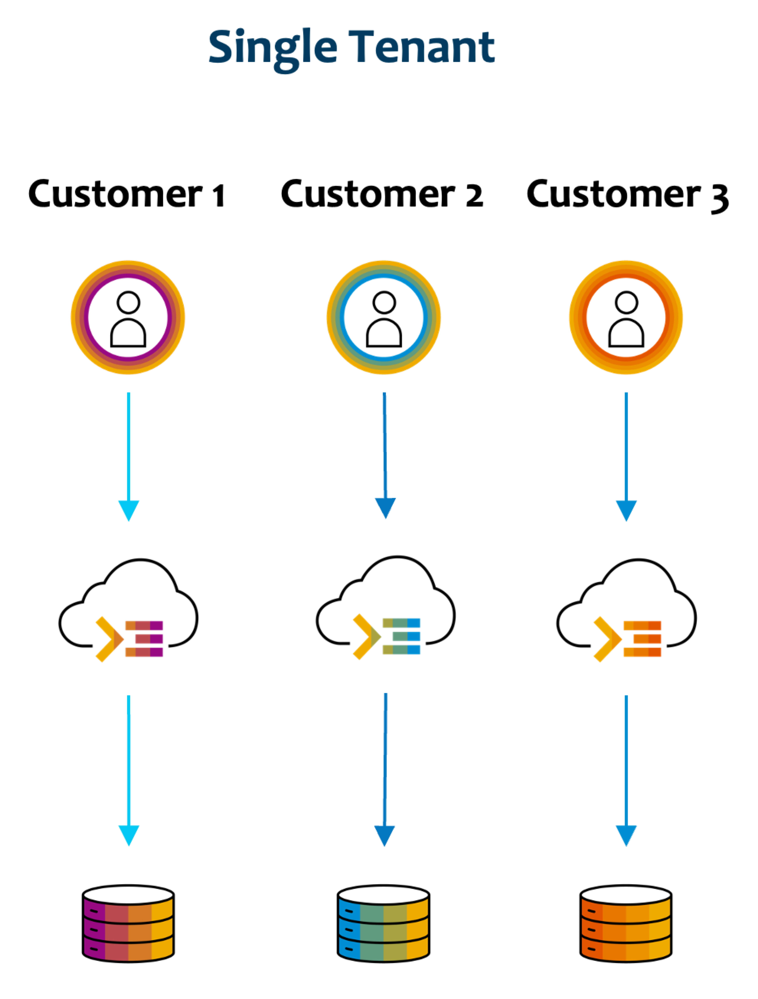

In today's rapidly evolving digital landscape, multitenancy has become a crucial concept in the context of SAP architecture, particularly for SAP partners and line of business (LoB) teams developing applications on [SAP Business Technology Platform (SAP BTP)](https://www.sap.com/india/products/technology-platform.html). As businesses increasingly turn to SaaS solutions for their needs, understanding and leveraging multitenancy has become essential for creating innovative, scalable, and cost-effective applications within the SAP ecosystem.

Multitenant SaaS applications built on SAP BTP offer a powerful way to extend SAP's core solutions and address specific industry or business needs at scale. By allowing multiple customers to share a single instance of the software, multitenancy lowers costs and makes maintenance simple for all users. This approach not only drives innovation and scalability but also enables faster time-to-market and more efficient resource utilization.

Successful examples of multitenant applications on SAP BTP, such as [Circelligence by BCG](https://www.bcg.com/capabilities/climate-change-sustainability/circular-economy-circelligence) for circular economy management and [SAP Advanced Financial Closing](https://www.sap.com/products/financial-management/advanced-financial-closing.html) for streamlining financial close processes, demonstrate the potential for innovation and the ability to address specialized needs within the SAP landscape. These applications showcase how multi-tenancy can be leveraged to deliver scalable and efficient solutions to a diverse range of customers.

In this reference architecture, we will explore the key components and best practices for designing and implementing multitenant applications on SAP BTP. This reference architecture aims to provide practical insights and guidance for developing and deploying such applications, enabling our stakeholders to harness the full potential of SaaS solutions within the SAP environment.

## Overview

**_Multitenancy_** is a software architecture in which a single instance of a software application serves multiple customers, known as tenants. Each tenant is logically separated and operates as if they have their own isolated environment, even though they share the same underlying resources, such as the application itself, databases, and infrastructure. This allows for cost-efficient resource sharing and centralized management, making it an attractive model for SaaS providers.

| Single Tenancy | Multitenancy |
|:---:|:---:|
|||
|In single tenancy design, for each customer, a separate instance of the application is deployed|In multitenancy design, a single application instance is deployed which severs multiple customers |

## Key Aspects

1.  ### Tenants and Tenant Isolation
    - A **_Tenant_** represents a group of users (a company, a department, or an organization) who share common access privileges, configuration and data. In a multitenant environment, tenants may share the same software, infrastructure, and resources but should experience the application as if they have their own separate system.
    - **_Tenant Isolation_** ensures that each tenant's data and configurations are kept separate from other tenants. This is crucial for maintaining data privacy, security, and compliance.
2.	### Single Software Instance
    - Multitenancy allows for a **_single instance_** of the software application (or service) to serve multiple tenants simultaneously. This is key to the architecture's efficiency, as it minimizes resource usage by reducing duplication of infrastructure, application code, and maintenance efforts.
    - Despite running a single software instance, Tenants are unaware of each other's existence, and each tenant's users and data remains isolated.
3.	### Shared Resources
    - One of the most important aspects of multitenancy is the ability to **share resources** across multiple tenants without them being aware of it. Resources shared can include:
      - **Compute Resources**: CPU, memory, and network bandwidth are shared to ensure efficient use of server resources.
      - **Storage Resources**: File systems or databases are partitioned or shared depending on the level of tenant isolation.
    - Multitenant systems can dynamically allocate resources based on demand, scaling up or down as necessary.    
4.	### Data Isolation and Security
    - While tenants share the same application instance, their data and configurations are isolated to ensure privacy and security. This can be achieved in several ways:
      - **Logical Separation**: Separate database tables, schemas, or databases can be used for each tenant.
      - **Access Controls**: Enterprise-Grade security models are implemented to restrict access to resources and ensure each tenant can only view and manipulate their own data.
      - **Compliance**: Multitenant architectures must comply with various data protection laws like GDPR, HIPAA, or SOC 2, especially when dealing with sensitive or regulated industries.
      - **Identity Management**: Identities, identity management and authentication shall be maintainable and configurable per tenant.
5. ### Performance and Resource Contention
    - In a multitenant environment, performance is a key concern because multiple tenants are competing for the same set of resources. Resource contention can occur when one tenant’s usage affects the performance experienced by other tenants. This is managed through:
      - **Resource Allocation and Throttling**: The system allocates resources based on tenant needs and may throttle tenants who exceed their usage quotas to prevent them from affecting others.
      - **Horizontal Scalability**: Multitenant systems are typically designed to scale horizontally by adding more servers or instances when demand increases. This allows the system to handle large numbers of tenants without performance degradation.
      - **Load Balancing**: Ensures even distribution of traffic and resource usage across servers to avoid bottlenecks and ensure consistent performance.
6.  ### Tenant Onboarding and Offboarding
    - Multitenant systems typically have processes in place to efficiently onboard new tenants and offboard existing ones.
      - **Onboarding**: New tenants can be added dynamically without requiring additional infrastructure setup. The application automatically provisions resources (e.g., database schemas) and configures settings specific to the tenant.
      - **Offboarding**: When a tenant decides to leave, their data can be removed without affecting the rest of the system.

## Deep Dive
Implementing multitenant application on SAP BTP is a journey that involves understanding, planning, implementation, and continuous improvement. You can deep dive into various concepts, services and architecture before developing a multitenant application.
- [Benefits of Multitenant Applications](2-mt-benefits/readme.md)
- [Tenant Model on SAP BTP](3-mt-models/readme.md)
- [Reference Architecture](5-mt-architecture/readme.md)
- [Lifecycle Management](4-mt-lifecycle/readme.md)
- [Total Cost of Ownership](6-mt-tco/readme.md)
- [Authentication Strategies](7-mt-authentication/readme.md)

## References
- [SAP Blog - Fundamentals of Multitenancy in SAP BTP](https://community.sap.com/t5/technology-blogs-by-sap/fundamentals-of-multitenancy-in-sap-btp/ba-p/13527283)
- [Tenant Isolation](https://docs.aws.amazon.com/whitepapers/latest/saas-architecture-fundamentals/tenant-isolation.html)