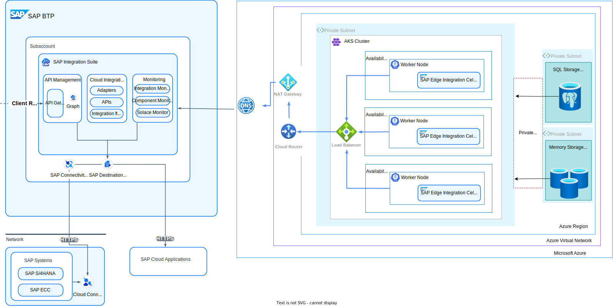

---
############################################################
#                Beginning of Front Matter                 #
############################################################
#                     [DO NOT MODIFY]                      #
############################################################
id: id-ra0008-2 
slug: /ref-arch/f2670637a8/2 
sidebar_position: 2 
sidebar_custom_props: 
  category_index: 
    - aws
    - gcp
    - azure
############################################################
#     You can modify the front matter properties below     #
############################################################
title: Edge Integration Cell on Azure
description: Explore the reference architecture for deploying SAP Integration Suite - Edge Integration Cell on Azure. Learn about the required resources, and key considerations for setup and implementation on Azure.
sidebar_label: Edge Integration Cell on Azure
keywords: [azure, eic, edge integration cell]
image: 
tags: [azure, eic]
hide_table_of_contents: false
hide_title: false
toc_min_heading_level: 2
toc_max_heading_level: 4
draft: false
unlisted: false
contributors:
  - madankumarpichamuthu
last_update:
  date: 2025-02-20
  author: madankumarpichamuthu
############################################################
#                   End of Front Matter                    #
############################################################
---

SAP Integration Suite – Edge Integration Cell (EIC) can be deployed on Azure to leverage its scalable infrastructure while maintaining secure and controlled execution in a customer-managed environment. This architecture combines Azure-native services with EIC’s hybrid capabilities, ensuring a seamless integration experience.

## Architecture

## Overview
Deploying EIC on Azure requires a secure, scalable, and resilient infrastructure that adheres to enterprise compliance and hybrid cloud best practices. This setup ensures that sensitive data stays within a private Azure environment while leveraging SAP Integration Suite in the cloud for design, monitoring, and lifecycle management.  

### Azure Setup

### 1. VNet, SubNet and Networking

To ensure a **secure and private execution environment**, create a **[Virtuan Network (VNet)](https://learn.microsoft.com/en-us/azure/virtual-network/quick-create-portal)** with **multi-AZ redundancy** for high availability (HA).

- **Multi-AZ Deployment**:
  - Distribute your **EIC components** across **three Azure Availability Zones (AZs)** to ensure high availability. This setup helps maintain continuous service in case one AZ goes down, as the workload automatically fails over to another AZ.
  
- **Network Segmentation**:
  - **[Private Subnets](https://learn.microsoft.com/en-us/azure/virtual-network/virtual-network-manage-subnet?tabs=azure-portal)**: Deploy critical **EIC runtime components** in **private subnets** to prevent direct access from public internet.
  - **[Public Subnets](https://learn.microsoft.com/en-us/azure/virtual-network/virtual-networks-overview)**: These subnets are used for components like **EC2-based bastion hosts** or **[Network Load Balancers (NLB)](https://learn.microsoft.com/en-us/azure/load-balancer/load-balancer-overview)**, which handle external traffic and distribute the load across different AZs.

- **Internet Access Control for EIC**:
  - **[NAT Gateways](https://learn.microsoft.com/en-us/azure/nat-gateway/nat-overview)**: Azure NAT Gateway components in private subnets to securely access external services without exposing internal EIC workloads to the internet.
  - **[Internet Gateway](https://azure.microsoft.com/en-us/products/azure-nat-gateway)**: For EIC runtime components that need outbound internet access, the Internet Gateway enables the necessary connectivity.
  - **[Security Groups](https://learn.microsoft.com/en-us/azure/virtual-network/network-security-groups-overview)** and **[IP Based Network ACLs](https://learn.microsoft.com/en-us/azure/virtual-network/ip-based-access-control-list-overview)**: These are used to enforce strict access control, ensuring secure communication between EIC components.

#### 2. Azure AKS Cluster  

EIC workloads require a **containerized runtime**, making **[Azure Kubernetes Service (AKS)](https://azure.microsoft.com/en-us/products/kubernetes-service)** the preferred choice for **managing and scaling** integration flows.  

- **Cluster Setup**:  
  - The **AKS control plane** is fully managed by Azure, reducing operational overhead.  
  - **Worker nodes** are deployed in **private subnets** for **enhanced security**.  

- **Security and Access Control**:  
  - Use **[Azure roles for service accounts (RBAC)](https://learn.microsoft.com/en-us/azure/role-based-access-control/role-assignments-portal)** to grant least-privilege permissions to pods.  

  For sizing recommendations, refer to this [SAP Note](https://me.sap.com/notes/3247839)

#### 3. Storage and Databases  

EIC requires multiple storage solutions for transaction logs, runtime data, and caching.

- **Azure PostgreSQL RDS**  
  - **[Azure RDS for PostgreSQL](https://azure.microsoft.com/en-ca/products/postgresql/?ef_id=_k_Cj0KCQiAwtu9BhC8ARIsAI9JHanckghAmiPvL8qvi_nfi1zhYHFW3Z0hIV3E_WIGpmnJjfs6rvd5BGQaAkISEALw_wcB_k_&OCID=AIDcmmqz3gd78m_SEM__k_Cj0KCQiAwtu9BhC8ARIsAI9JHanckghAmiPvL8qvi_nfi1zhYHFW3Z0hIV3E_WIGpmnJjfs6rvd5BGQaAkISEALw_wcB_k_&gad_source=1&gclid=Cj0KCQiAwtu9BhC8ARIsAI9JHanckghAmiPvL8qvi_nfi1zhYHFW3Z0hIV3E_WIGpmnJjfs6rvd5BGQaAkISEALw_wcB)** is recommended for EIC.
  - Enable **[AKS Multi-AZ replication](https://learn.microsoft.com/en-us/azure/storage/container-storage/enable-multi-zone-redundancy)** for high availability.

- **Azure RedisCache**  
  - **[Azure RedisCache](https://azure.microsoft.com/en-ca/products/cache/?ef_id=_k_Cj0KCQiAwtu9BhC8ARIsAI9JHakLVqdO5TEkgDIz5U2E5xUnS-j_huvw4zf8bUr8C4xQo8N_NSXfgw0aAtpvEALw_wcB_k_&OCID=AIDcmmqz3gd78m_SEM__k_Cj0KCQiAwtu9BhC8ARIsAI9JHakLVqdO5TEkgDIz5U2E5xUnS-j_huvw4zf8bUr8C4xQo8N_NSXfgw0aAtpvEALw_wcB_k_&gad_source=1&gclid=Cj0KCQiAwtu9BhC8ARIsAI9JHakLVqdO5TEkgDIz5U2E5xUnS-j_huvw4zf8bUr8C4xQo8N_NSXfgw0aAtpvEALw_wcB)** helps reduce latency by caching frequently accessed EIC runtime data using Redis

### SAP Setup

#### 1. Activate EIC in your SAP BTP Subaccount
- Activate **[Edge Integration Cell (EIC)](https://help.sap.com/docs/integration-suite/sap-integration-suite/what-is-sap-integration-suite-edge-integration-cell)** in your **[SAP Business Technology Platform (BTP)](https://help.sap.com/docs/btp?locale=en-US)** subaccount.  
- Assign the necessary roles to enable access to **Edge Lifecycle Management (ELM)** for managing and monitoring Edge nodes.  

#### 2. Configure a Technical User and Set Up SSO 
- Create a **technical users** (**[P-User](https://help.sap.com/docs/EDGE_LIFECYCLE_MANAGEMENT/9d5719aae5aa4d479083253ba79c23f9/edcd1a455afb4cb0b6b1b3d148256468.html)** and **[S-User](https://www.sap.com/account/universal-id.html)**) to interact with the SAP systems and to access SAP repository based shipment channel.  
- Set up **Single Sign-On (SSO)** for secure repository access, including monitoring and logging.  

#### 3. Add an Edge Node and Bootstrap to Kubernetes
- Add an **Edge Node** in Edge Lifecycle Management (ELM) and bootstrap it to your **Azure AKS cluster** running in your private Azure landscape.   

## Resources

You can find detailed, step-by-step instructions for both the basic and high availability (HA) setup, including SAP and Azure configuration and deployment steps, in the following GitHub repository:

[**Deploy SAP Integration Suite - Edge Integration Cell on on Microsoft Azure**](https://github.tools.sap/btp-use-case-factory/edge-integration-cell-azure)

## Recommendation
The architecture and setup instructions in the GitHub repository above outline a small production deployment. Since deployments vary depending on business needs, these recommendations should be treated as a starting point.

## Explore More
- [**Blog:** Getting Started with Edge Integration Cell on AZure: A Setup Guide Using SAP Integration Suite](https://www.youtube.com/watch?si=y-OM-2GC-q-FnOxm&v=PHPPnma7Y1A&feature=youtu.be)
- [Setting Up and Managing Edge Integration Cell](https://help.sap.com/docs/integration-suite/sap-integration-suite/setting-up-and-managing-edge-integration-cell)