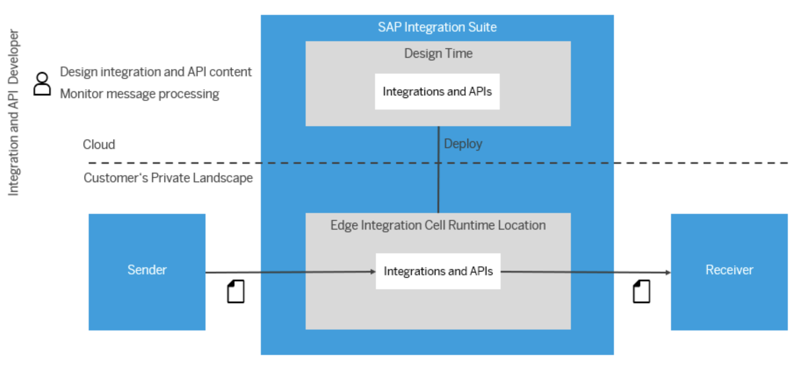

In today's enterprise landscape, organizations are under increasing pressure to modernize their integration strategies. They must connect a growing mix of SAP and non-SAP systems, deployed across cloud, on-premise, and hybrid environments — all while adhering to strict data security, regulatory compliance, and performance expectations.

**SAP Integration Suite – Edge Integration Cell (EIC)** emerges as a strategic solution to these challenges. It enables customers to deploy integration capabilities within their **private infrastructure**, while still benefiting from the centralized governance and design-time tools of the cloud-based **SAP Integration Suite**.

This architecture document explores the rationale, design considerations, and business value of adopting **SAP EIC**.

## Architecture

## Flow

The architecture diagram above illustrates the high-level setup of the Edge Integration Cell (EIC). To deploy EIC in your private landscape, follow these steps:

### Hyperscaler Setup

-   Set up an isolated network environment within your private hyperscaler landscape.
-   Provision a Kubernetes cluster to serve as a secure and scalable runtime for EIC.
-   Configure storage services to manage runtime data.

### SAP BTP Setup

-   Activate EIC in your SAP BTP subaccount and assign the necessary roles for accessing Edge Lifecycle Management (ELM).
-   Configure a technical user and set up Single Sign-On (SSO) for repository access, monitoring, and logging.
-   Add an Edge Node and bootstrap it to the Kubernetes cluster in your private landscape.

## Problem Statement and Relevance

Let’s consider an enterprise using SAP Process Integration (PI) or SAP Process Orchestration (PO) for core application integration and message processing across on-premise systems. As the business grows and expands into cloud-based applications and digital channels, it needs to integrate its legacy on-prem systems with:

-   **Cloud-based analytics or workflow services** on SAP BTP
-   **Modern event-driven architectures** powered by SAP Integration Suite - Advanced Event Mesh for real-time, decoupled communication
-   **External partners**, logistics providers, or third-party cloud services

However, they face three key roadblocks:

-   **Data Residency & Compliance**: Data compliance laws restrict the processing of sensitive data outside national borders, including but not limited to financial and customer information.
-   **Security Policy**: Security policies prohibit inbound access from external networks or cloud regions.
-   **Network Latency**: Latency when executing integration flows in distant cloud regions, especially when the nearest SAP BTP region is far from the on-premise systems, affects time-sensitive operations.

The enterprise needs a solution that enables secure, compliant, and reliable integration while maintaining operational efficiency, ensuring seamless connectivity across on-premise and cloud environments.

## Solution Overview: What is SAP Edge Integration Cell (EIC)?

**SAP Edge Integration Cell (EIC)** offers the ideal solution to the above challenges by providing a seamless balance between local execution and cloud-level agility. It enhances the capabilities of SAP Integration Suite by enabling integration flows to be executed locally, within a private cloud or on-premise infrastructure, while maintaining centralized design, monitoring, and governance through SAP BTP.

-   **Design & Governance in the Cloud**: Integration artifacts (iFlows) are modeled using the web-based Integration Suite tooling in SAP BTP.
-   **Secure Communication**: The EIC runtime communicates with SAP BTP over secure, outbound-only channels, avoiding any inbound exposure to the public internet.
-   **Execution at the Edge**: These integration flows are deployed to the EIC runtime within the enterprise's secure network — either in a private hyperscaler **VPC** or on-premise.

With EIC, businesses can modernize integration while meeting strict data protection, security, and performance requirements.

## Value Proposition

#### i. Security & Compliance by Design

In regulated industries like finance, healthcare, and manufacturing, enterprises must demonstrate full control over data processing. With **EIC**:

-   Data never leaves the corporate network unless explicitly allowed.
-   Sensitive information (e.g., personal health data, financial records, IP-related manufacturing data) can be integrated and transformed without cloud exposure.
-   Supports data residency and localization laws, especially in countries where SAP BTP is not available or not approved for regulated workloads.
-   Avoidance of performance bottlenecks due to geographic distance between cloud regions and operational systems.

#### ii. Hybrid Deployment Flexibility

Architects can modernize their integration architecture incrementally:

-   **Bridge legacy and cloud**: Connect SAP ECC, PI/PO, and legacy apps with new SAP BTP services.
-   **Central governance, distributed execution**: Maintain unified visibility and control via SAP BTP, even as execution happens locally.
-   **Support for diverse topologies**: **EIC** runs on Kubernetes (e.g., AWS EKS, Azure AKS, GCP GKE, or on-prem clusters), fitting into the customer's existing infrastructure choices.

#### iii. Latency & Performance Optimization

By deploying the integration runtime close to the source systems (e.g., within the same data center or VPC), **EIC** ensures:

-   Low-latency integration between critical systems like SAP S/4HANA and manufacturing systems.
-   Improved performance for real-time use cases, such as production line automation or supply chain synchronization.

## Some Strategic Use Cases Enabled by EIC

### i. SAP PI/PO Modernization through Hybrid Integration

Organizations transitioning from SAP Process Integration (PI) or Process Orchestration (PO) to SAP Integration Suite can use **SAP Edge Integration Cell (EIC)** to support hybrid integration scenarios while maintaining full control over local execution.

**EIC can be leveraged in the following ways:**

-   **Secure Cloud Connectivity**: Enables integration between on-premise **SAP** systems and cloud-hosted applications via secure, outbound-only communication.
-   **Event-Driven Architecture**: Supports real-time, decoupled communication using Advanced Event Mesh integrated with managed event brokers.
-   **End-to-End Monitoring**: Delivers full visibility into integration flows — from ingress to egress — whether processed locally or in the cloud.
-   **Message-Oriented Middleware**: Connects seamlessly with existing enterprise messaging systems to support reliable message exchange without added latency or operational risk.

This approach enables a **phased modernization strategy**, allowing enterprises to transition from legacy middleware while preserving data locality, compliance, and governed integration.  
**Example**: A financial services firm retires its on-prem PI system and uses **EIC** to move to cloud-managed design-time with local execution.

### ii. Latency Optimization and Regional Availability Constraints

**EIC** addresses latency and data residency concerns when SAP BTP is not locally available or when integration flows are subject to cross-border data transfer limitations.

**Example: Regional Availability and Data Residency**  
SAP BTP is not currently available in all regions where **RISE with SAP** is offered. For example, organizations operating in the GCP Canada region are required to run their **SAP Integration Suite** workloads from Iowa, USA.  
This setup introduces increased network latency and results in sensitive data crossing national boundaries — posing significant compliance and data residency concerns.

By deploying **SAP Edge Integration Cell (EIC)** within the same data center as their RISE environment, organizations can execute integration flows locally.  
This ensures adherence to security policies, performance expectations, and regulatory requirements — without compromising their cloud strategy.

### iii. On-Premise & Private Cloud Integration

Organizations with data center-based SAP systems (e.g., S/4HANA, ECC) can use **EIC** to connect these securely to other on-premise or cloud applications — without punching holes in firewalls or exposing sensitive data.  
**Example**: Integrating on-prem SAP S/4HANA with a supplier portal hosted in Azure, using secure edge processing.

### iv. Regulatory Compliance in Data-Sensitive Regions

**EIC** is a critical enabler for global enterprises operating in regions with no local SAP BTP region or with strict data sovereignty laws.  
**Example**: A healthcare provider in the Middle East uses **EIC** to process patient integration flows locally, complying with national data protection laws.

### v. Edge Processing for Industrial & IoT Scenarios

In factory settings, integration often involves machine data, IoT events, or shop-floor applications. **EIC** brings processing closer to the source, reducing reliance on external networks.  
**Example**: A logistics hub uses **EIC** to process sensor data from conveyor systems and sync it with SAP EWM systems without any internet dependency.

## Non-Functional Requirements Addressed

| **Requirement**   | **How EIC Meets It**                                                           |
| ----------------- | ------------------------------------------------------------------------------ |
| **Security**      | No inbound traffic, runs in private network, integrates with enterprise IAM    |
| **Compliance**    | Supports data residency, regulatory mandates (GDPR, HIPAA, etc.)               |
| **Reliability**   | Deployed on high-availability Kubernetes clusters with local failover options  |
| **Performance**   | Reduced network hops, optimized for low-latency integration                    |
| **Scalability**   | Kubernetes-native deployment allows horizontal scaling based on workload needs |
| **Observability** | Integration monitoring via central SAP Integration Suite tools                 |

## Conclusion: Architecting for Control and Agility

**SAP Edge Integration Cell** represents a powerful architectural pattern for hybrid enterprises.  
It empowers integration architects to:

-   Maintain security and compliance
-   Improve integration performance
-   Enable future-ready modernization
-   Adapt integration strategy to regional constraints and global growth

By deploying **EIC**, organizations don’t have to choose between the control of on-premise and the innovation of cloud.  
They can have both — with a **hybrid integration platform** designed for the modern enterprise.

## Resources

-   [SAP Edge Integration Cell](https://help.sap.com/docs/integration-suite/sap-integration-suite/what-is-sap-integration-suite-edge-integration-cell)
-   [SAP Integration Suite](https://help.sap.com/docs/integration-suite?locale=en-US)
-   [EIC Technical Landscape](https://help.sap.com/docs/integration-suite/sap-integration-suite/technical-landscape-edge)
-   [Hybrid Deployment Using Edge Integration Cell](https://help.sap.com/docs/integration-suite/sap-integration-suite/hybrid-deployment-using-edge-integration-cell)
-   [**Blog:** Getting Started with Edge Integration Cell on AWS: A Setup Guide Using SAP Integration Suite](https://community.sap.com/t5/technology-blogs-by-sap/getting-started-with-edge-integration-cell-on-aws-a-setup-guide-using-sap/ba-p/13880982)
