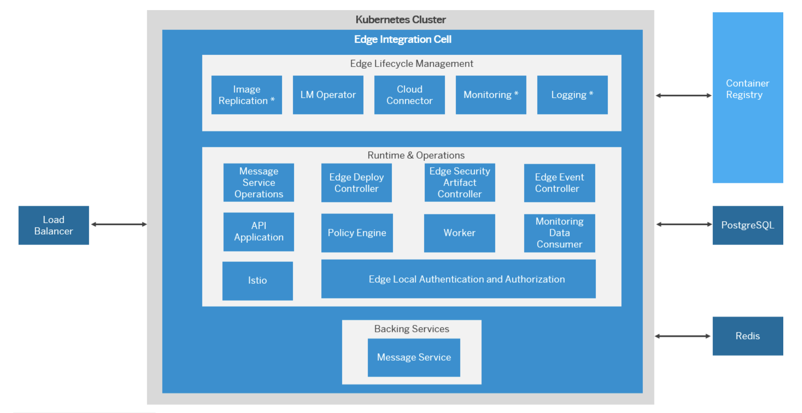

---
############################################################
#                Beginning of Front Matter                 #
############################################################
id: id-ra0008 # [DO NOT MODIFY]
slug: /ref-arch/f2670637a8 # [DO NOT MODIFY]
sidebar_position: 8 # [DO NOT MODIFY] 
sidebar_custom_props: # [DO NOT MODIFY]
  category_index: 
    - aws
    - gcp
    - azure
    - integration
    - appdev
############################################################
#     You can modify the front matter properties below     #
############################################################
title: Edge Integration Cell on Hyperscalers
description: Discover reference architectures for deploying SAP Integration Suite - Edge Integration Cell on hyperscalers. Access architecture diagrams and key resources to understand its setup and implementation.
sidebar_label: Edge Integration Cell on Hyperscalers
keywords: [sap, aws, azure, gcp, eic, edge integration cell]
image: img/logo.svg
tags: [aws, azure, gcp, eic]
hide_table_of_contents: false
hide_title: false
toc_min_heading_level: 2
toc_max_heading_level: 4
draft: false
unlisted: false
contributors:
  - adarshnarayanhegde
  - madankumarpichamuthu
  - AFK-Python
last_update:
  date: 2025-02-17
  author: adarshnarayanhegde
############################################################
#                   End of Front Matter                    #
############################################################
---

Edge Integration Cell (EIC), part of the SAP Integration Suite, brings a powerful hybrid integration runtime that bridges the gap between the cloud and your private landscape. It provides the flexibility to seamlessly manage APIs and run integration scenarios within a controlled environment, combining the best of both worlds.

With its hybrid deployment model, EIC makes it easy to design and monitor integration content in the cloud, while still allowing it to be securely deployed and run in a customer managed private environment.

## Architecture

## Flow  
The architecture diagram above illustrates the high-level setup of the Edge Integration Cell (EIC). To deploy EIC in your private landscape, follow these steps:  

### Hyperscaler Setup  
- Set up an isolated network environment within your private hyperscaler landscape.  
- Provision a Kubernetes cluster to serve as a secure and scalable runtime for EIC.  
- Configure storage services to manage runtime data.  

### SAP BTP Setup  
- Activate EIC in your SAP BTP subaccount and assign the necessary roles for accessing Edge Lifecycle Management (ELM).  
- Configure a technical user and set up Single Sign-On (SSO) for repository access, monitoring, and logging.  
- Add an Edge Node and bootstrap it to the Kubernetes cluster in your private landscape.  
 

## Characteristics

1. **Security or compliance use cases:** Sensitive data stays safely within an enterprise's firewall, following strict rules to keep it within a private environment.  

2. **Migration path for SAP Process Integration customers:** EIC helps customers design and monitor integration content in the cloud, while keeping deployment and execution fully within their private environments.  

## Services and Components  

### Services  

- **SAP Integration Suite**: An industry-leading, enterprise-grade integration platform-as-a-service (iPaaS) that enables businesses to seamlessly connect and integrate their applications, data, and processes within and beyond their organization.  

- **Managed Kubernetes Service**: Kubernetes serves as the runtime environment for EIC, providing a scalable and secure infrastructure for enterprise-grade integration scenarios.

- **Storage Services**: Storage solutions, including block storage, databases, and data stores, ensure efficient storage of runtime and logging data generated by EIC.  

### Components  

- **Edge Lifecycle Management (Edge LM)**: The foundation for software lifecycle management, providing a shipment channel for SAP Business Technology Platform-based products like EIC. It enables the delivery and management of containerized workloads in on-premise or edge computing environments. Edge LM also serves as a central hub for managing and monitoring integration scenarios running in the EIC environment.  

- **Runtime and Operations**: The core component of EIC responsible for executing integration scenarios within the customer's private landscape. It also includes management capabilities for edge operations.  

- **Backing Services**: EIC relies on various backing services to support its functionality. These include messaging services for asynchronous communication, load balancing to distribute traffic across Kubernetes nodes and services, and other essential services required for integration and operational efficiency.  

## Resources 
- [SAP Edge Integration Cell](https://help.sap.com/docs/integration-suite/sap-integration-suite/what-is-sap-integration-suite-edge-integration-cell)
- [SAP Integration Suite](https://help.sap.com/docs/integration-suite?locale=en-US)
- [EIC Technical Landscape](https://help.sap.com/docs/integration-suite/sap-integration-suite/technical-landscape-edge)
- [Hybrid Deployment Using Edge Integration Cell](https://help.sap.com/docs/integration-suite/sap-integration-suite/hybrid-deployment-using-edge-integration-cell)
- [**Blog:** Getting Started with Edge Integration Cell on AWS: A Setup Guide Using SAP Integration Suite](https://community.sap.com/t5/technology-blogs-by-sap/getting-started-with-edge-integration-cell-on-aws-a-setup-guide-using-sap/ba-p/13880982)

