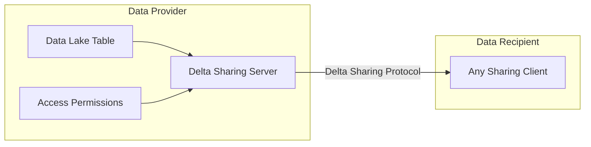
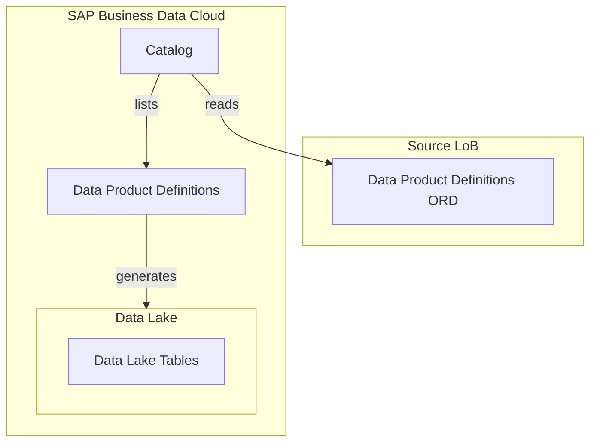
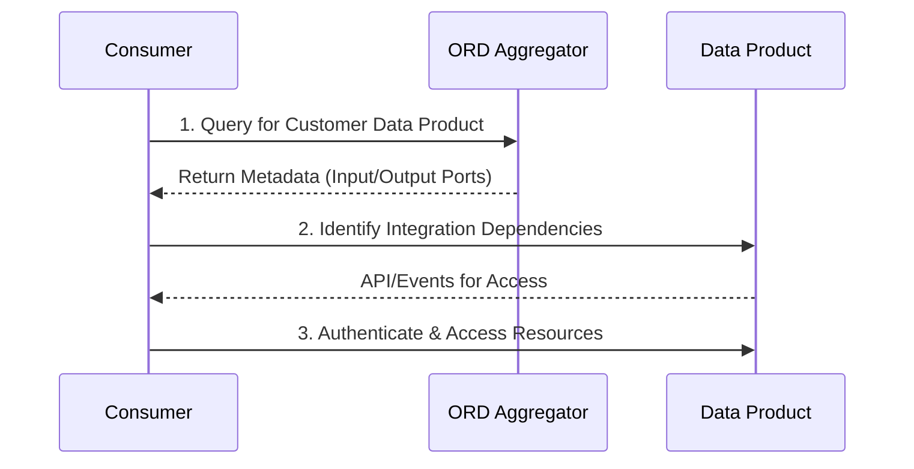

---
############################################################
#                Beginning of Front Matter                 #
############################################################
#                     [DO NOT MODIFY]                      #
############################################################
id: id-ra0013-1
slug: /ref-arch/ad1b90dbd1/1
sidebar_position: 1
sidebar_custom_props:
    category_index: []
############################################################
#     You can modify the front matter properties below     #
############################################################
title: Data Products in SAP Business Data Cloud
description: The purpose of Data Products in the context of SAP is the efficient and standardized sharing and consumption of data across applications and domains. It helps ensure high-quality metadata, is optimized for intensive reads, and describes the lineage and interfaces available for integration.
sidebar_label: Data Products in SAP Business Data Cloud
keywords: [sap, bdc, business, data, cloud, data product]
image: img/logo.svg
tags: [data, aws, azure, gcp]
hide_table_of_contents: false
hide_title: false
toc_min_heading_level: 2
toc_max_heading_level: 4
draft: false
unlisted: false
contributors:
    - jasoncwluo
    - jmsrpp
    - anbazhagan-uma
last_update:
    date: 2025-04-18
    author: jmsrpp
############################################################
#                   End of Front Matter                    #
############################################################
---

Data Products in SAP Business Data Cloud serve as a standardized and efficient way to share and consume data across applications and domains. They enable analytic scenarios, AI applications, and facilitate data integration while being optimized for intensive reads. Managed with a product mindset, they are supported by high-quality metadata and governed by decentralized ownership principles.

## Purpose of Data Products

### Key Objectives

**1. Efficient Data Sharing Across Domains**: Data Products facilitate replication-free integration and consumption by SAP, customer, and partner applications via APIs and Events.

**2. Efficient Data Storage**: Data Products are processed and curated in a modern object-store based data lake architecture with highly scalable Spark processing.
      
**3. High-Quality Metadata**: Metadata includes business semantics and is accessible through directories like the Data Product Directory and ORD Aggregators, enhancing discoverability.

**4. Optimized for Analytics**:Data sets are curated for intensive reads and consumed in a read-only fashion, ensuring efficiency and reliability.

**5. Supporting Analytical and AI Applications**: Data Products provide foundational data for dashboards, analytical models, and AI applications.

**6. Decentralized Ownership**: Inspired by Data Mesh principles, Data Products are owned and managed by domain experts or teams responsible for operational data.

**7. Lifecycle Management**: Data Products undergo needs analysis, design, and delivery phases, ensuring their accuracy and relevance.

## Integration and Consumption

Data Products are exposed for consumption via APIs, Events, or [Delta Sharing](https://www.databricks.com/product/delta-sharing) protocols. They are described using [Open Resource Discovery (ORD)](https://open-resource-discovery.github.io/specification/) metadata, which includes attributes such as visibility, release status, and integration dependencies. 

### Components of Data Products

**1. Data Aspect**:

   - Includes business objects, analytical data, graph data, and spatial data.
   - Optimized for intensive reads and consumed in a read-only fashion.

**2. API Aspect**:

   - APIs are described with metadata for machine and human-readable documentation.
   - Supports protocols like Delta Sharing and [CSN Interop](https://sap.github.io/csn-interop-specification/).

**3. Metadata Aspect**:

   - ORD Aggregators collect metadata for discoverability.
   - Includes attributes like visibility, integration dependencies, and output ports.

**4. Product Aspect**:

   - Managed with a product mindset, focusing on consumer needs.
   - Includes defined owners responsible for lifecycle and quality.

**5. Business Semantic Aspect**:
   - Describes semantic models using Entity Types, bridging conceptual and technical data models.

## Architecture of Data Products

### Data Sharing View

### Discovery and Generation Workflow

### Consumption Workflow

#### Steps

   - **1. Discovery**: 
   Consumers query ORD Aggregators to find Data Products and associated metadata.

   - **2. Integration**:
   Consumers establish connections based on integration dependencies (input ports).

   - **3. Consumption**:
   Resources are accessed via APIs or Events defined in output ports.

### Delta Sharing Protocol

Delta Sharing is an open protocol for sharing data stored in cloud-based Data Lake tables. It enables:

- **Zero-Copy Data Access**: No need to move or copy data, ensuring efficient data usage.
- **Central Governance**: Controlled access and scalable sharing.
- **Multi-Tool Support**: Compatible with tools like Apache Spark and Python.

#### Workflow

1. **Data Provider**:
   - Shares tables/partitions via Delta Sharing Server.
   - Manages access permissions.

2. **Data Consumer**:
   - Uses Delta Sharing clients to authenticate and access data.
   - Temporary URLs facilitate fast, large-scale data transfer.

## Types of Data Products

### SAP-managed vs customer-managed Data Products

- Starting with SAP S/4HANA Cloud, SAP is providing a comprehensive set of **SAP-managed data products** across the Lines of Business (LoB). Customer only need to activate these predefined data products and then SAP takes care for extraction, loading and data curation.
- Customer also can create their own **customer-managed data products** to enhance the set of data products with data from any SAP or non-SAP application. Customer-managed data products are curated in SAP Datasphere. The data and ORD file(s) are stored in the customer-managed object store within SAP Datasphere.
- Both type of data products are technically identical. They are stored in an object store, described via ORD file and published in the SAP BDC data catalogue.
   
### Data Packages

- Grouping of related SAP-managed Data Products for streamlined onboarding and activation in SAP Business Data Cloud.
**Remark:** 
- SAP-managed Data products cannot be activated individually. They only can be activated via Insight App or on data package level. That means that all the data products within the data package or Insight app are activated in one step.

### Primary Data Product (sub type of a data product)

- Directly provided from applications, representing original data from source applications.

### Derived Data Product (sub type of a data product)

- Curated by SAP and derived from other data sets, delivering value-add based on existing Data Products or APIs.

## Key Attributes of Data Products

| **Attribute**                | **Description**                                                       |
| ---------------------------- | --------------------------------------------------------------------- |
| **Type**                     | Defines the type (primary, derived).                                  |
| **Category**                 | Categorizes the data set (e.g., business-object, analytical).         |
| **Visibility**               | Specifies exposure (public, internal, private).                       |
| **Input Ports**              | Integration dependencies describing data inputs for lineage purposes. |
| **Output Ports**             | APIs or Events through which the data can be accessed.                |
| **Integration Dependencies** | Relationships with external resources.                                |
| **Responsible**              | Organization/team responsible for lifecycle management.               |

## Foundation Services in SAP Business Data Cloud

### Purpose
Foundation Services facilitate the discovery, extraction, and consumption of SAP-managed Data Products. These services onboard the different Lines of Business (LoB) applications in SAP progressively, starting with SAP S/4HANA Cloud.

## Features

**1. Open Resource Discovery (ORD)**:

   - Enables decentralized discoverability of Data Products.

**2. Data Lake Storage, including Spark Runtime**:

   - Stores data as Data Lake tables, following Delta Sharing principles.
   - Medallion architecture with Bronze, Silver and Gold (optionally) and processing of data via Spark processing framework.

**3. SAP-Managed Data Products**:
   - Provides ready-to-use data products for analytics and AI applications.

## Business Benefits of Data Products

**1. Accelerated Time to Insight**

- Pre-built solutions eliminate lengthy data preparation
- Business users can access trusted data immediately
- Reduced dependency on IT for data requests
- Faster decision-making with ready-to-use analytics

**2. Improved Data Quality and Trust**

- Standardized data definitions across the organization
- Clear data lineage showing where information originated
- Consistent business rules applied to calculations
- Certified data products with quality guarantees

**3. Enhanced Self-Service Capabilities**

- Business-friendly interfaces requiring minimal technical knowledge
- Ability to explore data and create insights independently
- User-controlled personalization of analytics views
- Reduced bottlenecks from centralized reporting teams

**4. Cross-Functional Data Integration**

- Unified view of data spanning multiple SAP systems
- Integration of SAP data with external sources
- Breaking down data silos between departments
- Consistent "single version of truth" for business metrics

**5. Cost and Resource Optimization**

- Reduced duplication of data extraction and preparation
- Lower development costs through reusable data assets
- Decreased support burden through standardization
- More efficient use of analytical talent on insights rather than data wrangling

**6. Governance and Compliance**

- Built-in security controls and access management
- Automated enforcement of data privacy policies
- Comprehensive audit trails for sensitive data
- Simplified regulatory reporting with trusted data sources

**7. Business Agility**

- Ability to quickly combine different data products for new insights
- Faster response to changing business conditions
- Reduced friction in launching new analytics initiatives
- Data-driven culture enabled by accessible, trusted information

## Conclusion

Data Products in SAP Business Data Cloud streamline data sharing, integration, and analytics across domains. Supported by high-quality metadata, Delta Sharing protocols, and decentralized ownership principles, they are optimized for intensive reads and managed with a product mindset. Foundation Services ensure seamless discoverability and consumption, empowering businesses to make data-driven decisions efficiently.
