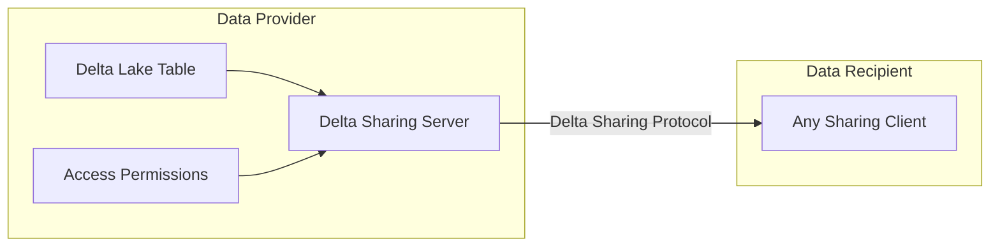
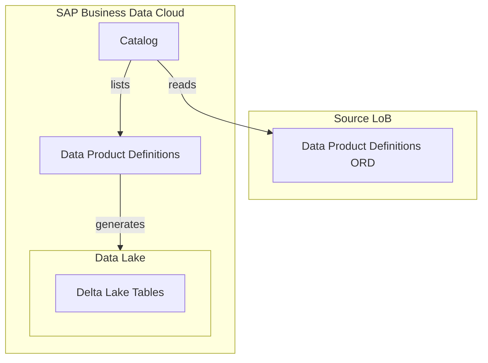
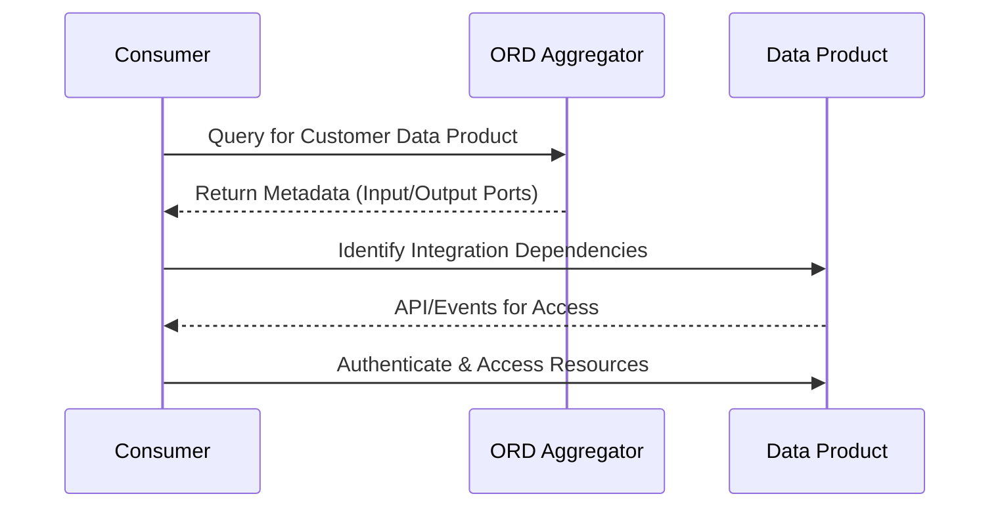

---
############################################################
#                Beginning of Front Matter                 #
############################################################
#                     [DO NOT MODIFY]                      #
############################################################
id: id-ra0013-2 
slug: /ref-arch/ad1b90dbd1/2
sidebar_position: 2
sidebar_custom_props:
    category_index: []
############################################################
#     You can modify the front matter properties below     #
############################################################
title: Data Products in SAP Business Data Cloud
description: The purpose of Data Products in the context of SAP is the efficient and standardized sharing and consumption of data across applications and domains. It helps ensure high-quality metadata, is optimized for intensive reads, and describes the lineage and interfaces available for integration.
sidebar_label: Data Products in SAP Business Data Cloud
keywords: [sap, bdc, business, data, cloud, data product]
image: img/logo.svg
tags: [data, aws, azure, gcp]
hide_table_of_contents: false
hide_title: false
toc_min_heading_level: 2
toc_max_heading_level: 4
draft: false
unlisted: false
contributors:
    - jasoncwluo
    - jmsrpp
    - anbazhagan-uma
last_update:
    date: 2025-04-18
    author: jmsrpp
############################################################
#                   End of Front Matter                    #
############################################################
---

Data Products in SAP Business Data Cloud serve as a standardized and efficient way to share and consume data across applications and domains. They enable analytic scenarios, AI applications, and facilitate data integration while being optimized for intensive reads. Managed with a product mindset, they are supported by high-quality metadata and governed by decentralized ownership principles.

## Purpose of Data Products

### Key Objectives

1. **Efficient Data Sharing Across Domains**:

   - Data Products facilitate integration and consumption by SAP, customer, and partner applications via APIs and Events.

2. **High-Quality Metadata**:

   - Metadata includes business semantics and is accessible through directories like the Data Product Directory and ORD Aggregators, enhancing discoverability.

3. **Optimized for Analytics**:

   - Data sets are curated for intensive reads and consumed in a read-only fashion, ensuring efficiency and reliability.

4. **Supporting Analytical and AI Applications**:

   - Data Products provide foundational data for dashboards, analytical models, and AI applications.

5. **Decentralized Ownership**:

   - Inspired by Data Mesh principles, Data Products are owned and managed by domain experts or teams responsible for operational data.

6. **Lifecycle Management**:
   - Data Products undergo needs analysis, design, and delivery phases, ensuring their accuracy and relevance.

## Integration and Consumption

Data Products are exposed for consumption via APIs, Events, or Delta Sharing protocols. They are described using [Open Resource Discovery (ORD)](https://open-resource-discovery.github.io/specification/) metadata, which includes attributes such as visibility, release status, and integration dependencies.

### Components of Data Products

1. **Data Aspect**:

   - Includes business objects, analytical data, graph data, and spatial data.
   - Optimized for intensive reads and consumed in a read-only fashion.

2. **API Aspect**:

   - APIs are described with metadata for machine and human-readable documentation.
   - Supports protocols like Delta Sharing and [CSN Interop](https://sap.github.io/csn-interop-specification/).

3. **Metadata Aspect**:

   - ORD Aggregators collect metadata for discoverability.
   - Includes attributes like visibility, integration dependencies, and output ports.

4. **Product Aspect**:

   - Managed with a product mindset, focusing on consumer needs.
   - Includes defined owners responsible for lifecycle and quality.

5. **Business Semantic Aspect**:
   - Describes semantic models using Entity Types, bridging conceptual and technical data models.

## Architecture of Data Products

### Data Sharing View

### Discovery and Generation Workflow

### Consumption Workflow

### Steps

1. **Discovery**:

   - Consumers query ORD Aggregators to find Data Products and associated metadata.

2. **Integration**:

   - Consumers establish connections based on integration dependencies (input ports).

3. **Consumption**:
   - Resources are accessed via APIs or Events defined in output ports.

## Delta Sharing Protocol

### Concept

Delta Sharing is an open protocol for sharing data stored in cloud-based Delta Lake tables. It enables:

- **Zero-Copy Data Access**:

  - No need to move or copy data, ensuring efficient data usage.

- **Central Governance**:

  - Controlled access and scalable sharing.

- **Multi-Tool Support**:
  - Compatible with tools like Apache Spark and Python.

### Workflow

1. **Data Provider**:

   - Shares tables/partitions via Delta Sharing Server.
   - Manages access permissions.

2. **Data Consumer**:
   - Uses Delta Sharing clients to authenticate and access data.
   - Temporary URLs facilitate fast, large-scale data transfer.

## Types of Data Products

### Primary Data Product

- Directly provided from applications, representing original data from source applications.

### Derived Data Product

- Curated by SAP and derived from other data sets, delivering value-add based on existing Data Products or APIs.

### Data Packages

- Grouping of related Data Products for streamlined onboarding and activation in SAP Business Data Cloud.

## Key Attributes of Data Products

| **Attribute**                | **Description**                                                       |
| ---------------------------- | --------------------------------------------------------------------- |
| **Type**                     | Defines the type (primary, derived).                                  |
| **Category**                 | Categorizes the data set (e.g., business-object, analytical).         |
| **Visibility**               | Specifies exposure (public, internal, private).                       |
| **Input Ports**              | Integration dependencies describing data inputs for lineage purposes. |
| **Output Ports**             | APIs or Events through which the data can be accessed.                |
| **Integration Dependencies** | Relationships with external resources.                                |
| **Responsible**              | Organization/team responsible for lifecycle management.               |

# Foundation Services in SAP Business Data Cloud

## Purpose

Foundation Services facilitate the discovery, extraction, and consumption of Data Products across SAP Lines of Business (LoBs). These services onboard LoBs progressively, starting with SAP S/4HANA Cloud.

## Features

1. **Open Resource Discovery (ORD)**:

   - Enables decentralized discoverability of Data Products.

2. **Data Lake Storage**:

   - Stores data as Delta Lake tables, following Delta Sharing principles.

3. **Analytics and Machine Learning**:
   - Provides ready-to-use data for analytics and AI applications.

## Conclusion

Data Products in SAP Business Data Cloud streamline data sharing, integration, and analytics across domains. Supported by high-quality metadata, Delta Sharing protocols, and decentralized ownership principles, they are optimized for intensive reads and managed with a product mindset. Foundation Services ensure seamless discoverability and consumption, empowering businesses to make data-driven decisions efficiently.
