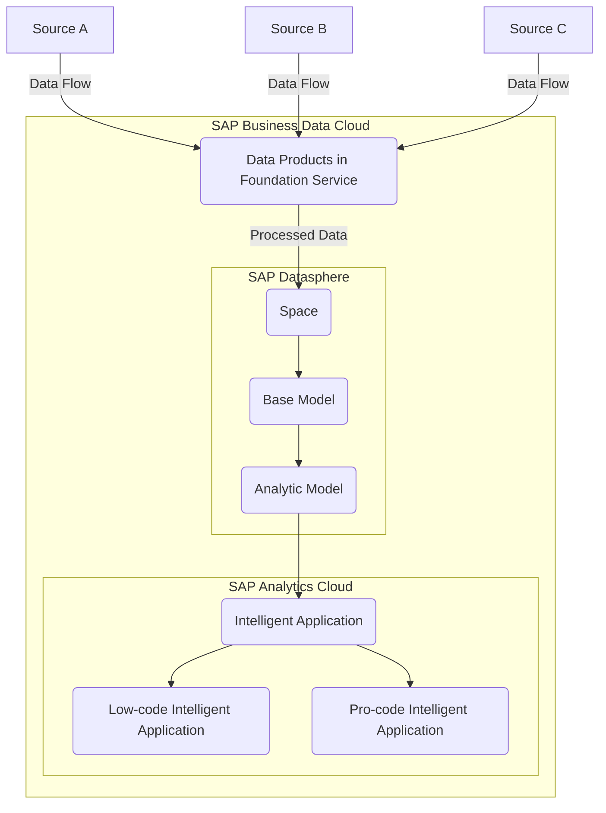

# Intelligent Applications by SAP

## Overview

Intelligent Applications in SAP Business Data Cloud provide pre-configured, SAP-managed dashboards and analytics based on underlying Data Products and models. These apps leverage SAP Analytics Cloud as the key front-end solution for visualization, simplifying the process of creating interactive reports and dashboards. Intelligent Applications reduce complexity, requiring only installation and role assignment for consumption.

## Architecture of Intelligent Applications

High-Level Object Structure of Intelligent Applications consist of:

**1. Visualization Objects**:
    - SAP Analytics Cloud stories serve as dashboards.
    - Interactive elements such as diagrams, tables, and charts.

**2. Underlying Models**:
    - SAP Datasphere-based analytic models and views.
    - Automated data replication and transformation services.

### Data Flows

The following diagram shows how raw source data is enriched as it moved through SAP BDC components until being surfaced in an Intelligent Application.

## Formation Setup for Intelligent Applications

To enable Intelligent Applications, SAP Business Data Cloud, SAP Analytics Cloud, and SAP Datasphere must operate in a formation. This involves:

**1. Single Sign-On**:

    - Seamless navigation between tenants of SAP Business Data Cloud, SAP Analytics Cloud, and SAP Datasphere.
    - Enabled via [SAP Cloud Identity Services](https://help.sap.com/docs/cloud-identity-services) and Identity Authentication.

**2. Live Data Connection**:

    - SAP-managed live data connections link SAP Datasphere objects to SAP Analytics Cloud for Intelligent Applications usage.

**3. Custom Connections**:
    - Users can create additional connections to access custom models and Data Products.

## Workflow of Intelligent Applications

### Installation

**1. Search and Install**:

    - Log in to SAP Business Data Cloud cockpit.
    - Browse available Intelligent Applications and their associated documentation.

**2. Automated Setup**:

    - Installation generates SAP-managed objects, including:
        - Associated Data Products.
        - Replication flows, tables, views, and analytic models in SAP Datasphere.
        - Scoped roles for the relevant spaces.

**3. Dashboard Creation**:
    - A dashboard is deployed as an SAP Analytics Cloud story for visualization.

### Visualization

-   Intelligent Applications provide interactive dashboards based on live data connections to SAP Datasphere.
-   Users can apply filters, select members or dimensions, and set variable values (e.g., target currency).

## Key Components of Intelligent Applications

| **Component**            | **Description**                                                                  |
| ------------------------ | -------------------------------------------------------------------------------- |
| **Visualization Object** | SAP Analytics Cloud story for dashboards and reports.                            |
| **Analytic Models**      | SAP Datasphere models that prepare and expose data for visualization.            |
| **Data Products**        | Data sets integrated into the analytic models, derived from Foundation Services. |
| **Foundation Services**  | Backend services for data replication and transformation.                        |
| **Roles**                | Scoped roles generated for access to relevant spaces.                            |

## Customization and Enhancement

### Copying Content

-   SAP-managed Intelligent Applications and their dependencies cannot be directly edited but components can be copied and adapted, as needed.
-   Users can copy SAP Analytics Cloud stories to enhance or adjust them for their needs.

### Enhancing Models

-   For advanced use cases, users can copy and modify the underlying analytic models.
-   Changes to models affect both original and copied stories.

## Features of Intelligent Applications

**1. Pre-Configured Dashboards**:
- Delivered as SAP Analytics Cloud stories.
- Based on SAP Datasphere models and views.

**2. Live Data Connection**:
- Real-time data access from SAP Datasphere to SAP Analytics Cloud.

**3. Scalable Deployment**:
- Installation automates creation of required objects and roles.

**4. Customizable**:
- Components such as stories and models can be copied and enhanced for specific use cases.

## How to Leverage SAP Intelligent Applications

**1. Selection and Deployment**

- Identify relevant Intelligent Applications from the SAP BDC marketplace
- Review capabilities and alignment with business objectives
- Deploy with minimal configuration required
- Customize to reflect your organization's specific metrics and processes

**2. User Adoption and Enablement**

- Access embedded best practices and analytical methodologies
- Follow recommended analysis paths for common business questions
- Use natural language interfaces (SAC JustAsk)

**3. Extending and Customizing**

- Add organization-specific metrics and calculations
- Create personalized views and dashboards
- Connect to additional data sources as needed
- Apply company-specific business rules and thresholds

**4. Business Value Realization**

- Track built-in adoption metrics and usage patterns
- Measure business impact through included KPI frameworks
- Identify opportunities for process improvement
- Share insights across departments using collaboration features
- Continuously optimize based on evolving business needs

## Conclusion

Intelligent Applications simplify the visualization and analysis of data in SAP Business Data Cloud. By leveraging SAP Analytics Cloud for dashboards and SAP Datasphere for data preparation, Intelligent Applications offer pre-configured, SAP-managed solutions that reduce complexity and enhance usability. Their architecture integrates Data Products, Foundation Services, and analytic models, ensuring seamless deployment and scalability while allowing customization for advanced scenarios.