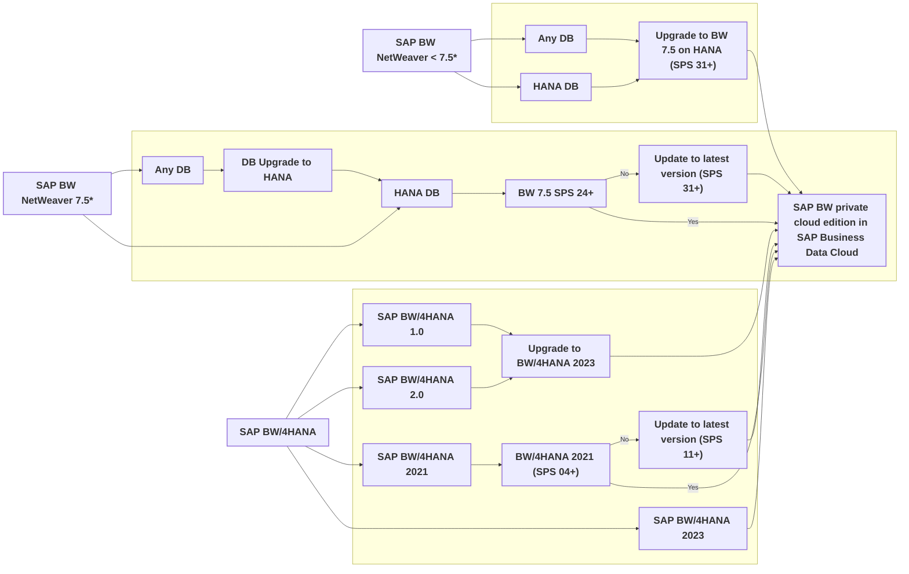

## Introduction

SAP Business Warehouse (BW) has been a cornerstone of enterprise data management for decades, providing essential insights for decision-making. However, the growing complexity of modern data landscapes, the need for real-time analytics, and the shift toward AI-driven processes demand a more scalable and integrated approach. SAP Business Data Cloud (SAP BDC) offers a path to modernize BW environments, enabling organizations to leverage existing investments while transitioning to a future-ready architecture.

With the introduction of SAP BW NetWeaver Cloud, private edition, SAP offers customers an option to lift their SAP BW NetWeaver to an SAP managed environment without the need to migrate to an intermediate solution until 2040 and benefit from an extended end of maintenance until 2030 for SAP BW NetWeaver Cloud, private edition.

As a result, customers can gradually shift SAP BW use cases to SAP Datasphere and replace respective data flows with proven capabilities within SAP Datasphere as well as data products and Intelligent Applications within SAP Business Data Cloud, instead of spending time and budget on a migration.

## Architectural Overview

SAP BW PCE is the Data Producer. This system is added in the SAP BDC Formation. With this addition, a dedicated provisioning space is created for BW PCE. Data Product Generator is a tool which is available in SAP BW PCE to create data products in Object Store in SAP BDC out of BW PCE. These data products gets generated as custom data products in the object store which is in the SAP BDC Tenant. From the provisioning space in SAP Datasphere, this can be shared with another space for modeling and consumption into SAP Analytics Cloud.

## Key Services and Components

The modernization process leverages the following components to transition BW environments to SAP BDC:

-   **SAP BW PCE**: Private cloud edition of BW for transitioning to SAP BDC.
-   **SAP Data Product Generator:** Enables creation of SAP BW data products for integration into SAP Datasphere.
-   **SAP Datasphere**: Centralized data management platform supporting self-service, semantic onboarding, and integration with data marketplaces.
-   **SAP Analytics Cloud:** Provides advanced analytics and visualization capabilities.
-   **SAP Databricks:** Supports AI/ML scenarios on unified SAP BW and SAP BDC data.
-   **Data Products**: Standardized datasets for AI/ML and cross-domain analytics.
-   **Intelligent Applications**: Pre-built applications for actionable intelligence.
-   **SAP BDC Cockpit**: Centralized management interface for SAP BDC.

## High-Level SAP BW Modernization Approach

Migration projects require careful planning to ensure continuity and minimize disruption. SAP’s approach addresses key enterprise concerns:

-   **Data Continuity**: Comprehensive validation ensures consistency and integrity during migration, with a focus on preserving historical data and business rules.
-   **Operational Stability**: Parallel operations during transition phases reduce business disruption, supported by robust fallback mechanisms.
-   **Capability Development**: Tailored training programs ensure teams can effectively manage and utilize the new SAP BDC environment.
-   **Security and Compliance**: Enterprise-grade security controls and compliance frameworks protect data and support audit requirements.

SAP provides a structured three-step approach for migrating SAP BW systems to the Business Data Cloud. This methodology focuses on leveraging existing BW data, transitioning to modern data products, and adopting a scalable, cloud-native architecture.

**The key benefits of SAP BW in the private cloud as part of SAP BDC are:**

-   SAP BW data products can be leveraged in SAP Databricks for ML/AI use cases and in SAP Datasphere for analytics scenarios, allowing the native implementation of BW use cases while following a zero copy approach.
-   The HANA Data Lake Files (object store) will be the large system option, reducing associated storage costs.
    Additionally, customers will benefit from data products and delta share mechanism, allowing a direct consumption in SAP Databricks for AI/ML use cases.
-   The Spark Engine enables custom coding options to replace existing ABAP code.
    In addition, Spark offers scalable compute capabilities supporting high-volume transformations. Spark compute is isolated from the analytics compute, avoiding mutual performance impact.

### Three-Step Migration Process

**1. Lift to SAP Business Warehouse Cloud, private edition**: Transition existing SAP BW NetWeaver or SAP BW/4HANA on-premises deployments into the private cloud component of SAP BDC. This step secures BW investments while exposing BW data as data products for consumption.

**Migration Pathways: Structured Transition Options**

The migration pathway depends on the current SAP BW system landscape. Below is a visual representation of the available paths, and the recommended approaches based on the environment:

:::note
Greenfield implementations go directly to SAP BW, private cloud edition in SAP Business Data Cloud

\*  Optional: convert to SAP BW/4HANA directly
    :::

**For SAP BW Systems on Non-HANA Databases** - **Initial Requirement**: Migrate to SAP HANA to enable real-time analytics and in-memory processing. - **Post-HANA Options**: - **SAP BW 7.5 on HANA**: Upgrade to enable SAP HANA-specific capabilities while retaining existing functionality. - **SAP BW/4HANA 2023**: Comprehensive modernization for seamless integration with SAP BDC.

**For SAP BW Systems already on SAP HANA** - **SAP NetWeaver < 7.5**: Upgrade to NetWeaver 7.5 (SP24+) or migrate directly to SAP BW/4HANA 2023. - **SAP NetWeaver 7.5**: Ensure Service Pack level meets minimum requirements (SP24+). - **Direct Path**: Migrate to SAP BW/4HANA 2023 for advanced capabilities.

**For Existing SAP BW/4HANA Environments** - **SAP BW/4HANA 1.0 or 2.0**: Upgrade to SAP BW/4HANA 2023 for latest features. - **SAP BW/4HANA 2021**: Apply the latest Service Pack or upgrade to SAP BW/4HANA 2023. - **SAP BW/4HANA 2023**: Implement the most recent Service Pack for optimal performance.

**2. Shift to SAP BW Data Product:** Begin using SAP BW data products and implement new use cases with direct access to SAP Datasphere’s object store.
Data product generator for SAP Business Data Cloud allows the creation of SAP BW data products based on selected InfoProviders within the object store and analytical layer of SAP Datasphere. Customers can re-use existing BW data and valuable semantics in a lakehouse architecture.

Note: the object store is not a cold store alternative, but enables SAP BW data product consumption and exposure.

**SAP BW Data Product**

-   **Base Data Product:** contains the flattened transactional data of the selected InfoProvider including master data which can be e.g. directly leveraged by SAP Databricks for ML/AI use cases via Delta Share.
-   **Refined Data Product:** consists of local tables that contain the transactional data and pre-defined associated dimensions, i.e. master data out-of-the-box for analytics use cases and can also be exposed via SQL Share.
-   **Derived Data Product:** uses the refined data product to define analytical measures or it includes the respective defined key figures, filters etc. - ready to use to gain further business insights and can also be consumed via OData.

With this, SAP BW Data product will be available for modelling and transformation purposes in SAP BDC. With delta share with SAP Databricks, proven SAP BW Data can be used for implementing AI/ML use cases. Update of data can be scheduled in a delta mode.

**3. Innovate with SAP Managed Data Products and Intelligent Applications:** Replace legacy BW workflows with SAP-managed data products and Intelligent Applications, adopting a lakehouse architecture. Over time, customer-managed BW data products are gradually replaced with SAP-managed data products.

Customer managed SAP BW Data Products will be gradually replaced with SAP managed data products. SAP managed data products and Intelligent Applications allow customers to consume and create analytics scenarios, following a clean core principle. Over a period of time, with this approach SAP BW system can be decommissioned.

-   Query and Composite Provider have been replaced with an Analytic Model and View using the onboarding in the catalog.
-   Replace Standard DataSources with SAP managed data products.
-   Translate Transformation from SAP BW into Transformation Flows in SAP Datasphere.
-   Replace and repoint existing Local Tables (File) based on SAP BW data to Local Tables (File) with data from SAP S/4HANA.
-   Access non-SAP DataSources via Replication Flows and push the data into Local Tables (File) or via Remote Tables in SAP Datasphere.
-   Translate Transformation from SAP BW into Transformation Flows or SQL Views in SAP Datasphere.
-   Replace and repoint existing Local Tables (File) based on SAP BW data to Local Tables (File) or View which is based on Remote Tables from non-SAP source.

## Key Benefits of SAP BW Modernization

-   **Scalable Architecture**: Transition to a cloud-native platform that adapts to evolving workloads.
-   **Unified Data Management**: Harmonize data across SAP and non-SAP systems for consistent analytics.
-   **Enhanced Analytics**: Enable real-time insights and advanced AI/ML capabilities.
-   **Reduced Maintenance**: Minimize administrative overhead with streamlined processes.
-   **Future-Ready**: Position your data infrastructure for ongoing innovation and scalability.

## Use Cases for BW Modernization

The modernization process unlocks new possibilities for leveraging SAP BW data:

-   **Building Intelligent Applications**: Develop data-driven applications integrating SAP BW and SAP BDC data products.
-   **AI/ML Scenarios**: Use SAP Databricks to apply advanced AI/ML models to BW data.
-   **Unified Data Platform**: Consolidate data from SAP and non-SAP sources for comprehensive analytics and insights.

## Expected TCO Benefits with SAP BDC and SAP BW PCE

-   **Transformation Effort:** No migration cost for upgrade to SAP BW/4HANA. Leverage SAP Standard data products with business semantics intact.
-   **Analytics and Tech Support Cost:** With adoption of Intelligent Applications and Data product, 50-80% reduction in cost as annual cost to build and maintain integrations. Reduction in annual monitoring, technical upgrade effort and reduce losses from unforeseen data risk,
-   **SAP Software & Maintenance:** No SAP BW/4HANA licence and annual maintenance. Eliminate SAP Datapshere Premium Outbound costs by leveraging zero copy approach.
-   **Infrastructure and Stack Cost:** Optimize hardware investment and reduce hardware size by offloading SAP BW Data volume to object store.

## SAP Learning Journey

[Modernizing your Data Warehouse Landscape - From SAP BW to SAP Datasphere](https://learning.sap.com/learning-journeys/modernizing-your-data-warehouse-landscape-from-sap-bw-to-sap-datasphere)

## Conclusion

Modernizing SAP BW with SAP Business Data Cloud provides a clear pathway to unlock agility, innovation, and scalability in enterprise data management. SAP BDC represents the future for on-premises SAP BW systems. By migrating to the private cloud version of SAP BW within SAP BDC, you safeguard your existing data and investments while gaining access to enhance capabilities.

By leveraging existing investments, transitioning to data products, and adopting advanced architectures, organizations can build a unified platform for real-time analytics and AI-driven insights. SAP’s structured approach ensures a seamless migration process, enabling businesses to address evolving demands and capitalize on their data assets effectively
