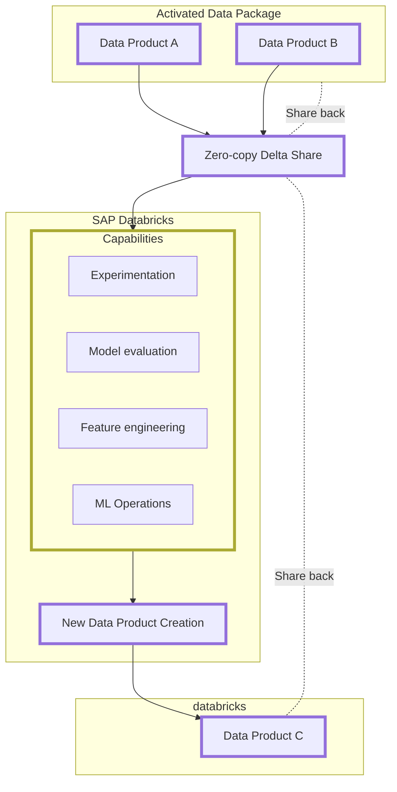

# SAP and Databricks Integration in SAP Business Data Cloud

SAP’s partnership with Databricks, a leader in unified data and AI platforms, helps streamline data access and enables businesses to harness SAP data for AI and machine learning use cases. This integration is delivered through SAP Databricks, a fully embedded OEM component of Databricks within the SAP Business Data Cloud.

## Role of SAP Databricks in SAP Business Data Cloud

SAP Databricks is a data intelligence platform designed to bring data and Artificial Intelligence (AI) together. Integrated within SAP Business Data Cloud, it provides a seamless way to execute machine learning algorithms on SAP data without requiring external ML platforms. By leveraging the Delta Share protocol, data products from SAP Business Data Cloud can be shared with SAP Databricks for processing, and the results can be stored back in the SAP environment, ensuring data security and governance.

Key features of SAP Databricks in this context include:

-   **AI/ML Lifecycle Support**: Enables experimentation, production, and deployment of machine learning models, including generative AI and large language models.
-   **Data Engineering**: Provides automated ETL processing, observability, and monitoring in a unified stack.
-   **Data Governance**: Manages structured and unstructured data, machine learning models, notebooks, dashboards, and files through Unity Catalog.
-   **Integration with SAP Ecosystem**: Results from SAP Databricks can be leveraged in SAP Datasphere for further analytics and application development, such as creating SAP Analytics Cloud stories.

This tailored version of SAP Databricks focuses on computing capabilities without including its complete architecture or standalone data storage, ensuring it aligns with the specific needs of SAP Business Data Cloud users.

## Architecture

## Characteristics

### Zero-copy Data Exchange

-   Data products from SAP applications, visible within the SAP Business Data Cloud catalog, can be shared with the embedded Unity Catalog of Databricks with a single click.
-   Leverages Delta Sharing to connect and blend data without the need for complex ETL pipelines.
-   Enables collaboration among multiple personas (data scientists, data analysts, and data engineers) on readily available SAP data.

### Development with Pro-code Tooling

-   Write Apache Spark pipelines to blend SAP and non-SAP data in SAP Databricks notebooks.
-   Build custom AI/ML solutions with Mosaic AI using trusted, AI-ready SAP data.
-   Use Databricks SQL to analyze data at scale for faster, data-driven decision-making.

## Integration Patterns

### Greenfield Integration - For Customers Without an Existing Enterprise Databricks Platform

-   Default scenario where SAP Business Data Cloud includes the SAP Databricks component.
-   Provides a tightly integrated, first-class Databricks experience in SAP Business Data Cloud.
-   Facilitates seamless bi-directional zero-copy data sharing using the Delta Share protocol.

### Brownfield Integration - For Customers With an Existing Enterprise Databricks Platform

-   Enables zero-copy data sharing with third-party Databricks environments using the Delta Share protocol.
-   Allows customers to retain their existing Databricks investment while leveraging curated SAP data without ETL for AI and analytics in Databricks.

## SAP Databricks Services and Components

-   **Delta Lake**: Open Data Lakehouse Foundation.
-   **Unity Catalog**: Unified security, governance, and cataloging.
-   **Databricks Notebook**: Data science, AI, and real-time analytics.
-   **Apache Spark**: Data processing and analytics with parallel processing capabilities.
-   **MLFlow**: Machine learning lifecycle management.

## Use Cases for SAP Databricks

-   **AI/ML**: Build robust models with curated SAP data in Databricks notebooks, create derived data products, and share them back with the SAP ecosystem for AI-driven decision-making.
-   **Data Engineering**: Process semi-structured and unstructured data at scale, blending curated SAP data to simplify data pipelines and improve collaboration.
-   **Analytics**: Explore and analyze large amounts of data shared in the Lakehouse (e.g., from BW) for real-time analytics and visualization.

The following diagram illustrates how SAP Databricks can be used to enrich and enhance existing SAP Data Products for sharing within the broader databricks ecosystem. The capabilities outlined above are used to create a new Data Product to share within the databricks Unity Catalog, or back into the SAP Datasphere component for further consumption.

