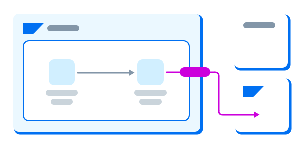

## What are Reference Architectures?

Reference architectures are templates in their simplest form. They generalize specific implementations of software with a common set of components, vocabulary, or configuration. In the SAP context, this means showing how applications, data, and AI operate at the product and service level, and how you can take advantage of repeatable best practices to optimize your SAP cloud and on-premises investments.

A reference architecture outlines the interactions between various services, showcasing how they work together seamlessly. It also demonstrates how these services integrate with business applications from SAP, partners, and third-party providers. This holistic view helps organizations understand the components needed to build a cohesive and efficient system. These templates provide a standardized approach to designing systems, ensuring best practices and optimal configurations are followed. They can easily be customized or adapted to a customer's unique environment and provide a foundation for adopting the latest cloud innovations from SAP. 

<em></em>

## Key benefits of using reference architectures

Reference architectures are a crucial tool in the development and implementation of IT systems, offering numerous benefits that can significantly enhance the efficiency and effectiveness of an organization's technology infrastructure. Here’s an expanded look at the key benefits of using reference architectures:

### Standardization 
- **Consistency Across Implementations**: Reference architectures provide a standardized approach to system design and implementation, ensuring that all components and processes adhere to a common set of guidelines and specifications. This standardization reduces variability and complexity, making it easier to manage and maintain the system over time.

### Best Practices
- **Avoiding Common Pitfalls**: By incorporating industry best practices into the design, reference architectures help organizations leverage the collective knowledge and experience of the industry. This helps avoid common pitfalls and ensures that systems are designed and built to perform optimally under various conditions.

### Scalability
- **Designing for Growth**: Reference architectures are designed with scalability in mind, providing a framework that supports the growth of the system alongside the business. By following a proven template, organizations can ensure their systems are capable of scaling efficiently to meet increasing demands without the need for major redesigns or overhauls.

### Efficiency
- **Streamlined Development Process**: With predefined interactions and configurations, reference architectures simplify the development process, reducing the time and resources required to design and implement new systems. This efficiency not only speeds up deployment but also reduces the likelihood of errors and omissions in the design phase.

### Interoperability
- **Seamless Integration**: Reference architectures provide a clear framework for integrating different components and systems, such as SAP BTP services with various business applications. This facilitates seamless interoperability, ensuring that different systems can work together effectively and share data and processes as needed.

Using reference architectures is a strategic approach to system development that offers numerous benefits, including standardization, incorporation of best practices, scalability, efficiency, and interoperability. These benefits collectively enhance the maintainability, performance, and flexibility of IT systems, making them a valuable asset for any organization looking to optimize its technology infrastructure.